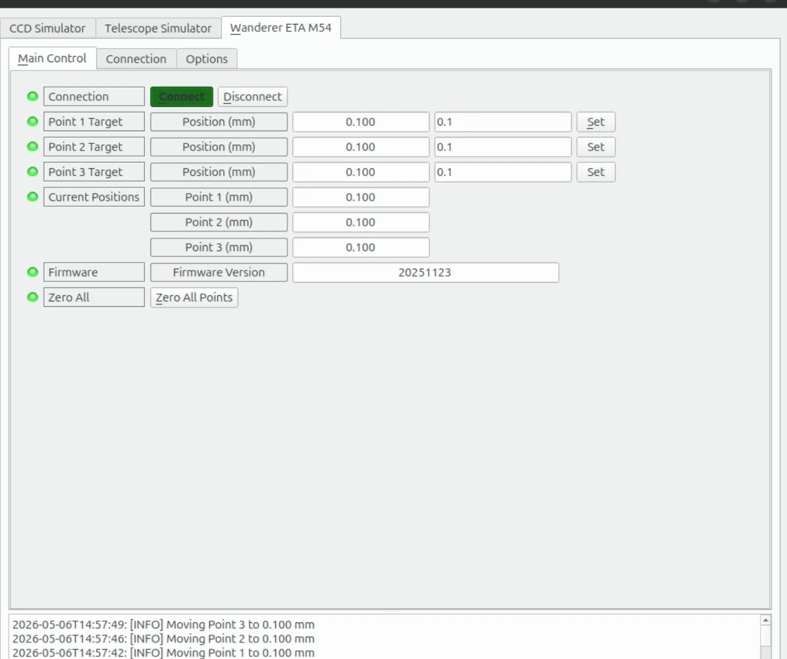

## Overview

The Wanderer ETA M54 is an ultra-thin (5mm) electronic tilt adjuster with three independently motorized adjustment points. It mounts between optical train components using M54 threads and allows precise tilt correction with 0.001mm resolution over a 0–1.200mm range per point.

The INDI driver communicates via USB serial (CH340 chip, 19200 baud) and provides independent control of all three tilt adjustment motors with real-time encoder position feedback.

## Features

- 3 independent motor position controls (0.000–1.200mm range, 0.001mm step)
- Real-time encoder position readback
- Zero All function to return all motors to home position
- Configuration save/restore (positions are remembered across sessions without triggering motor movement on reconnect)
- Position verification via continuous status stream polling

## Connection

Connect the Wanderer ETA M54 to a USB port. The device uses a CH340 USB-to-serial adapter.

1. In the **Connection** tab, select the serial port (typically `/dev/ttyUSB0`)
2. Baud rate is fixed at 19200 (configured automatically)
3. Click **Connect**

The driver reads the device's continuous status stream to verify the connection and displays the firmware version.

## Main Control

### Target Positions

Each motor point has its own target position property with an individual **Set** button:

- **Point 1 Target** — Set position for motor 1 (0.000–1.200mm)
- **Point 2 Target** — Set position for motor 2 (0.000–1.200mm)
- **Point 3 Target** — Set position for motor 3 (0.000–1.200mm)

Each motor moves independently. Setting one point does not affect the others.

### Current Positions

The **Current Positions** group shows real-time encoder readback from all three motors. These values update automatically every 2 seconds and reflect the actual physical position of each adjustment point.

### Zero All

The **Zero All Points** button moves all three motors to the 0.000mm position sequentially. Use this to return the device to a flat (no tilt) state.

### Firmware

Displays the firmware version reported by the device.

## Operation

### Adjusting Tilt

1. Connect to the device
2. Set the desired position for one or more points using the individual target fields
3. Click **Set** next to the point you want to move
4. The motor moves to the target position; readback updates in real-time
5. Repeat for other points as needed

The driver waits for each motor to reach its target (within ±0.005mm tolerance) before reporting completion.

### Saving Configuration

To preserve your tilt settings across sessions:

1. Set all points to the desired positions
2. Go to **Options** → **Save Configuration**

On the next connection, the saved positions are restored as targets without triggering any motor movement. Motors only move when you explicitly click **Set** or **Zero All**.

> [!IMPORTANT]
> The device does not have absolute position memory across power cycles. When powered on, the motors report their physical position from the encoders. The saved INDI configuration stores your last-used target values for convenience.

## Troubleshooting

| Symptom | Cause | Solution |
|---------|-------|----------|
| Timeout reading from device | ETA not powered or wrong port | Check USB connection, verify port in `dmesg` |
| Unknown device identifier | Wrong WandererAstro device on port | Ensure the ETA (not rotator/cover) is selected |
| Motor does not reach target | Mechanical obstruction | Check optical train for binding; reduce target value |

## Hardware Specifications

| Parameter | Value |
|-----------|-------|
| Interface | USB (CH340 serial adapter) |
| Baud Rate | 19200 |
| Thread | M54 × 0.75 |
| Thickness | 5mm |
| Travel Range | 0–1.200mm per point |
| Resolution | 0.001mm |
| Adjustment Points | 3 (120° spacing) |
| Power | USB bus powered |
