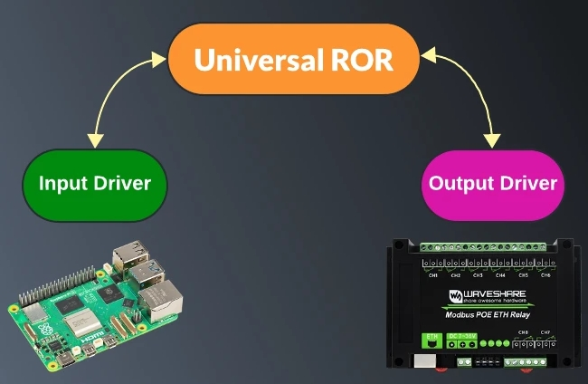
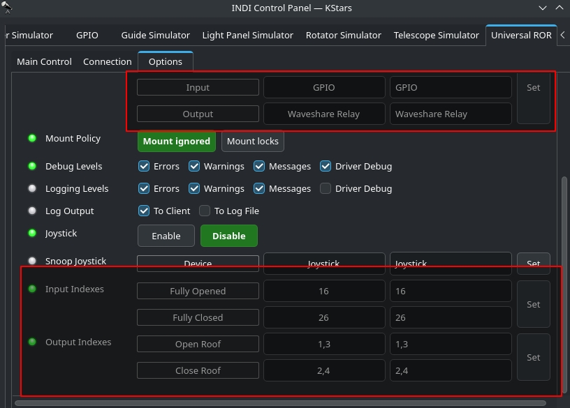
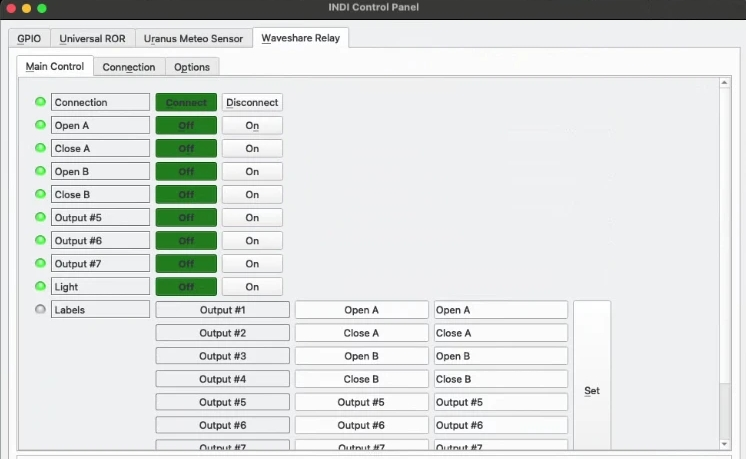

## Features

With the release of INDI v2.0.9, a new INDI Universal Roll-Off Roof (ROR) driver was introduced. Up to this point, there was no standanrd implementation for a simple ROR in INDI. Depending on you control your roof, you had to write your own INDI driver to control it in INDI. To facilitate ROR control in INDI, the new Universal ROR driver relies on two additional drivers interfaces:

-   **1. INDI::InputInterface**: This interface is used for drivers that want to report digital and analog inputs. It's a standarized way to report these readings. Standard properties are DIGITAL_INPUT_N (Starting from 1) and ANALOG_INPUT_N
-   **2. INDI::OutputInterface**: Used for drivers to trigger digital outputs (e.g. Relays and GPIOs). Standard properties are DIGITAL_OUTPUT_N

Using the interfaces above, INDI v2.0.9 introduced a few compatible drivers. We intend to support more observatory-class controllers, relays, and input sensors with upcoming releases:

1. **GPIO** driver: Uses libgpiod so it can work on multiple boards and not just raspberry pi. Driver utilizes both **Input** and **Output** interfaces. Currently driver only controls pins labeled as GPIO by the kernel.  
2. **Waveshare Relay** driver: Controls relays on [8-ch Ethernet Relay Module](https://www.waveshare.com/modbus-poe-eth-relay.htm). Driver utilizes **Output** interface.

3. **Luantico Dragon Controller** driver: An observatory-class controller that supports both **Input** and **Output** interfaces.

## Operation

To use the new Universal ROR driver with your own roll-off roof, you need the following:

-   **1. Output**: A command to open and close the roof motors. This is usually accomplished with relays.
-   **2. Input:** Fully opened and Fully closed sensors. Normally, mechanical or magnetic limit switches are used to cut the power off to the motors once the roof reaches either the fully opened (Unparked) or fully closed (Parked) states.

-   The digital inputs can be read as GPIO on a board like Raspberry or Orange PI or a dedicated observatory controller.

For my home observatory, two relays are used to opening the roof, and two more to close it. For input sensors, I used [1-Channel AC 220V Optocoupler Module](https://www.amazon.com/dp/B0C73GGKHX) to detect whether the fully closed and opened limit switches are actuated or not. This module is connected to Raspberry PI GPIO, which is running StellarMate OS running both the INDI GPIO, Waveshare Relay, and Universal ROR drivers.

Finally, the ROR driver can be configured to monitor for the INPUT and OUTPUT drivers. In my case, INPUT driver is INDI GPIO, and OUTPUT driver is Waveshare Relay. Next, you specify which digital input our outputs indexes are used for each.

Do not confuse this with GPIO numbering, you specify the DIGTAL_INPUT index as reported in the driver. For a single input/output, you simply put the index. For multiple coils, you add a comma-separated list. All the input and output labels can be customized.

