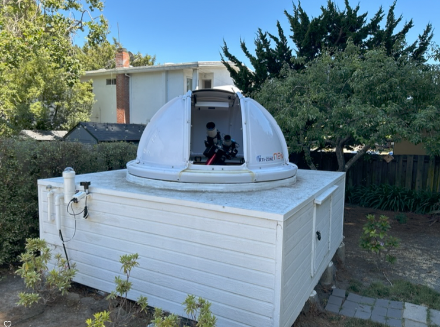
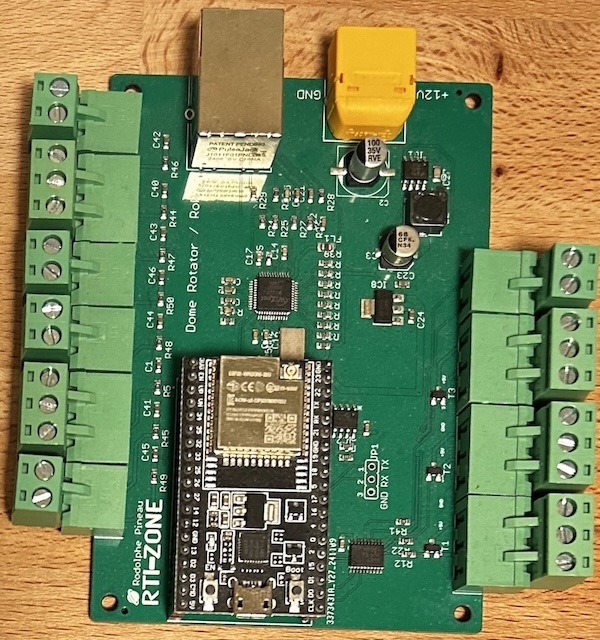
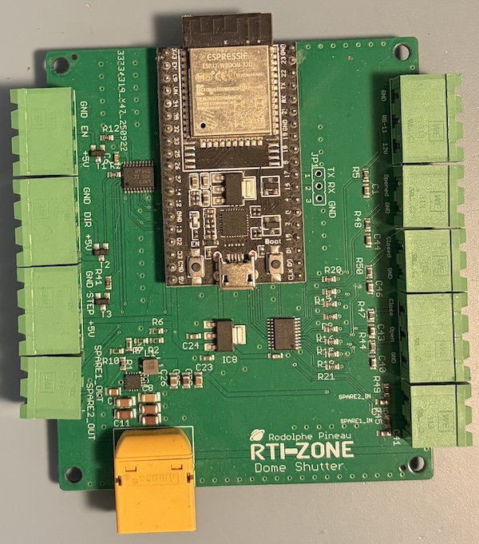
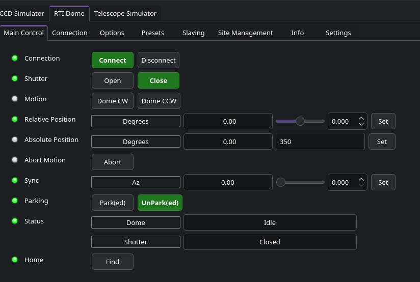
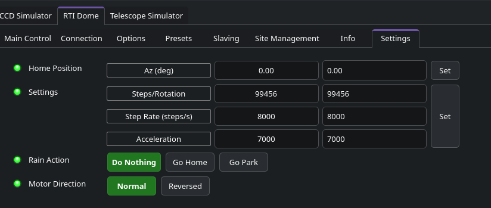
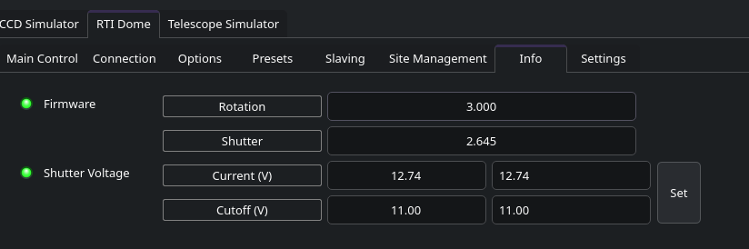

## Features

RTI-Dome is an open-source, high-performance DIY dome and shutter control system developed by Rodolphe Pineau (RTI-Zone). Designed for observatories of various sizes—from NexDome to heavy custom installations—it provides professional-grade features using accessible ESP32 hardware.

It supports the following features:

1.  **ESP32 Based**: High-speed processing with built-in WiFi and Ethernet (WIZnet W5500) capabilities.
2.  **High-Torque Support**: Compatible with powerful stepper drivers (TB6600, DMT556T) and NEMA 34 motors for heavy domes (tested up to 12Nm+).
3.  **Safety Integration**: Dedicated inputs for weather safety devices (AAG CloudWatcher, Hydreon RG-11) for automatic emergency shutter closure.
4.  **Dual Communication**: Supports both Ethernet/WiFi (Alpaca/TCP) and USB Serial (115200 baud).
5.  **Flexible Power**: Standard XT60 connectors; supports 12V natively with options for 24V-60V motor power using a dedicated power adapter.
6.  **Open Hardware**: PCB designs and firmware are fully open-source.

## Operation

The RTI-Dome system consists of two primary hardware components that communicate wirelessly:

1.  **Rotation Controller**: Manages the dome's azimuth rotation, motor torque, and external safety sensors.

2.  **Shutter Controller**: Mounts to the moving dome and manages the opening/closing of the shutter, typically powered by a battery or power ring.

Communication between the rotation controller and the shutter controller is handled via a dedicated local WiFi link, eliminating the need for complex wiring between the fixed and rotating parts of the dome.

## Integration with INDI

RTI-Dome is supported in INDI via two methods: a native driver for direct high-performance control, and the Alpaca bridge for network-based interoperability.

### Native INDI Driver (Recommended)

The native `indi_rti_dome` driver provides direct support for the RTI-Dome over both Serial and TCP/IP connections.

1.  **Connection**: Select either Serial or TCP in the connection settings.
2.  **Configuration**:
    *   **Serial**: Select the appropriate port (typically `/dev/ttyUSB0` or similar).
    *   **TCP**: Enter the IP address and port (default is 2323).
3. **Main control**: 

4. **Settings**:

5.  **Features**: Full support for Azimuth rotation (Absolute/Relative), Homing, Syncing, and Shutter control. It also provides monitoring for rain status and shutter battery voltage.

### Alpaca Support

RTI-Dome also features a native onboard Alpaca server, allowing for seamless integration via the **Alpaca Bridge**.

1.  **Use Bridge**: In Ekos/INDI, use the `indi_alpaca_dome` driver.
2.  **Configure**:
    *   **Hostname**: Set to the IP of the RTI-Dome.
    *   **Port**: 11111 (Default Alpaca port).
    *   **Device Number**: Usually 0.

## Credits & License

RTI-Dome is developed by **Rodolphe Pineau**.
*   **Project Page**: [rti-zone.org/astro_dome_control.php](https://rti-zone.org/astro_dome_control.php)
*   **Firmware & Hardware**: [GitHub (rpineau/RTI-Dome)](https://github.com/rpineau/RTI-Dome)
*   **Commands Documentation**: [Download PDF](https://rti-zone-files.s3.amazonaws.com/rti-dome-commands.pdf)
