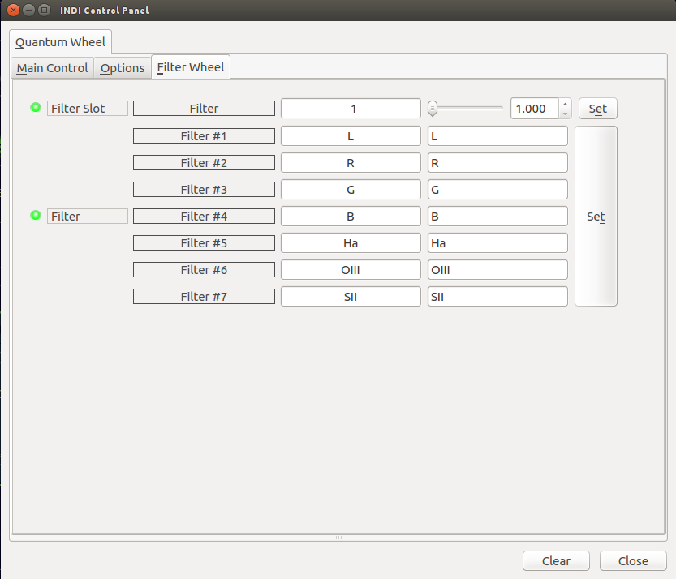

## Features

The driver supports Quantum Electronic Filter Wheel 7 x 1.25" / 2". It provides filter position control, assigning unique names for each filter and joystick control.

## Operation

The filter wheel uses USB serial port, which is /dev/ttyACM0 serial device. After connecting the filter wheel set your filter names and save the configuration under Options tab so they get loaded automatically on subsequent startups. Change the filter wheel position by changing the filter slot property.