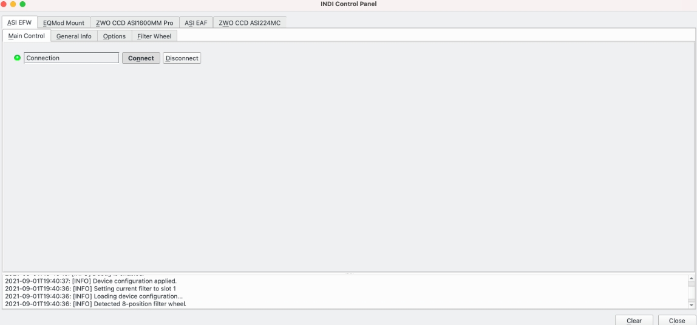
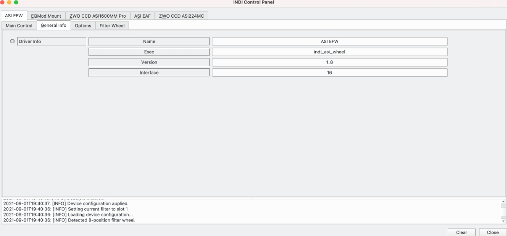
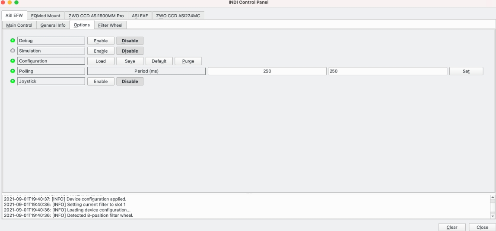
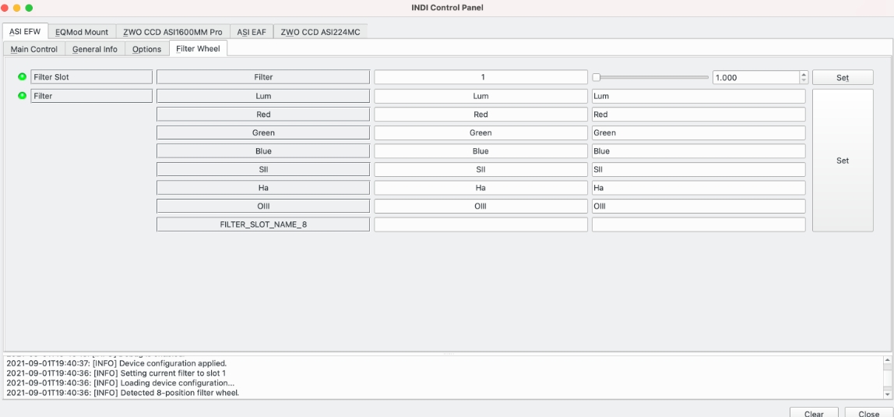

## Features

The INDI ASI EFW driver is for the ZWO ASI Electronic Filter Wheel (EFW). It supports all models. The devices **must**  be powered and connected before you run the INDI driver.

ASI offer several sizes of wheel, such as:

-   8x 1.25"
-   5x 1.25" or 5x 31mm
-   7x 36mm
-   5x 2"
-   7x 2"

## Connectivity

The EFWs connect via USB2.0.

## Operation

The INDI control panel in EKOS exposes data associated with the device and permits parameters to be set. In normal operation, higher level software, such as EKOS, will control the ASI EFW, but this section will utilise the INDI control panel to explain the available features.

### First Use

When the filter wheel is first connected and the  **ASI EFW**  driver used for the first time, it is recommended to setup the filter names to make future usage easier.

-   Power up the device.
-   Connect the  **ASI EFW**  driver.  **Main Control**  tab,  **Connect**.
-   Setup filter names for all the filters you have.
    -   Goto the  **Filter Wheel**  tab.
    -   Enter appropriate names for the filters you have and press  **Set**.
-   Go to  **Options**  tab and press  **Configuration**  ->  **Save**.

The  **ASI EFW**  driver is now ready to use.

### The Main Control Tab

### 

The  **Main Control**  Tab allows the device to  **Connect** /  **Disconnect**.

### The General Info Tab

The  **General Info**  tab displays basic information about the driver.

### The Options Tab

The  **Options**  tab provides generic control options over the filter wheel:

-   **Debug**: Displays the debug status. Note that debug options are set in Ekos as described  [here](https://stellarmate.com/support/logs-submission.html).
-   **Simulation**: Enable / disable simulation mode for testing purposes. In Simulation mode, parameters can be changed but not send to the device.
-   **Configuration**: Manage the driver configuration.
    -   **Load**: Load the last saved settings.
    -   **Save**: Save the driver settings.
    -   **Default**: Restore default settings that were shipped with the driver.
    -   **Purge**: Delete the configuration file.
-   **Polling**: Displays the mount polling period in milliseconds.
-   **Joystick**: Enable or Disable joystick support. An INDI Joystick driver must be running for this function to work. For more details, check the  [INDI Telescope Joystick](https://stellarmate.com/support/tutorials/135-controlling-your-telescope-with-a-joystick.html)  tutorial.

### Filter Wheel Tab

The  **Filter Wheel**  tab allows filter parameters to be displayed and set:

-   **Filter Slot**: Display / set the currently active filter position.
-   **Filter**: Display / set the name of the filter in each position in the wheel.