# ScopeLink

## Installation

| | |
|---|---|
| **Driver name** | ScopeLink |
| **Executable** | `indi_scopelink` |
| **Author** | Bence Toth, Astrolabs Hungary Kft. |
| **Maintainer** | Bence Toth <bence.toth@astrolabs.hu> |
| **Version** | 1.0 |
| **Device type** | Focuser, dust cap, light box, auxiliary |
| **Connection** | Serial (USB CDC-ACM) |
| **Minimum INDI** | 2.0.0 |
| **Platforms** | Linux (amd64, arm64) |

Install with `sudo apt install indi-scopelink`, or build it from source — the driver lives in
[indi-3rdparty](https://github.com/indilib/indi-3rdparty), and its `INSTALL.md` has the instructions.

After installing, reload the udev rules so the controller is reachable without root privileges:

```sh
sudo udevadm control --reload-rules && sudo udevadm trigger
```

## Overview

ScopeLink is a single-box telescope controller from Astrolabs. One USB connection drives:

- a stepper focuser
- a motorised front flap over the telescope aperture
- a flat panel
- two mirror cooling fans, thermostatically controlled against the mirror-to-ambient temperature
  difference or switched by hand
- two auxiliary power outputs
- a powered USB hub with per-port fault reporting (generation 3)

The driver publishes all of it as one INDI device. The interfaces it claims depend on what the connected
controller actually has, which is read out of the hardware at connect time.

### Supported models

| Generation | Focuser | Front flap | Aux power | USB hub | Smart switch diagnostics |
|---|---|---|---|---|---|
| 2 | yes | yes | yes | no | no |
| 3 | yes | yes | yes | yes | yes |

**Generation 3 is the production hardware.** Generation 2 is the earlier controller; it runs the same
code path, differing only in what the capability read at connect time turns on. The driver is tested
against real units of both.

The infrared temperature sensor is a fitting option rather than a generation difference. On a unit
without one, the temperature readings, the mirror ΔT and the automatic fan targets are not offered at
all, rather than being offered and failing.

## Connecting

Select **ScopeLink** in the Focuser slot of your Ekos equipment profile. Ekos picks up the dust cap and
light box interfaces from the same device automatically once it connects, so the front flap appears in
the cap controls and the flat panel in the flat frame settings — there is no need to add the device
twice.

On the **Connection** tab, set the port. Prefer the per-unit name under `/dev/serial/by-id/` to
`/dev/ttyACMn`, which is renumbered whenever another CDC device is plugged in first:

```sh
ls -l /dev/serial/by-id/
# usb-STMicroelectronics_STM32_Virtual_ComPort_in_FS_Mode_205E35793630-if00 -> ../../ttyACM0
```

The number in that name is the controller's USB serial, so it identifies one physical unit and a saved
profile keeps working across reboots and however many other USB devices are plugged in. Without the udev
rule installed you also have to be in the `dialout` group to open the port.

> [!NOTE]
> ScopeLink currently reports ST's generic USB identifiers, `0483:5740`, which every STM32 device running
> the stock USB CDC stack also reports. The udev rule therefore grants access but deliberately creates no
> `/dev/scopelink` name, since it could not tell a ScopeLink from any other such device. A product
> identifier of our own has been requested from STMicroelectronics.

The baud rate is offered because libindi's serial plugin expects one, but the controller is a CDC-ACM
device and ignores it.

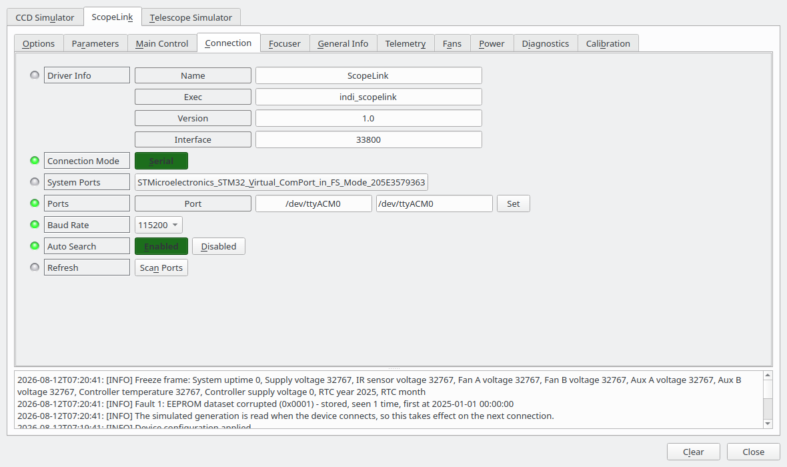

Two options are worth setting before the first connection, on the **Options** tab:

- **Step multiplier** — how many controller steps make one client step. Leave it at 1 unless the
  focuser's travel is large enough that a client is unhappy with the numbers. It is applied when the
  driver connects, so changing it while connected has no effect until you reconnect.
- **Controller diagnostics** — off by default. Turning it on adds the controller's own die temperature,
  supply rail, CPU and stack load and IÂ?C error counter to the Telemetry tab. These are for
  fault-finding, not for observing.
- **Simulated hardware** — which generation the driver imitates while **Simulation** is on. Ignored
  otherwise. See "Running without a controller" below.

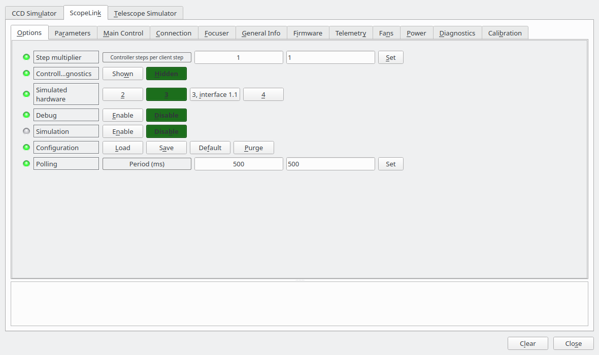

On a successful connection the **General Info** tab shows the hardware and interface versions, the
unit's hardware identifier and the firmware string. Quote all four in any support request.

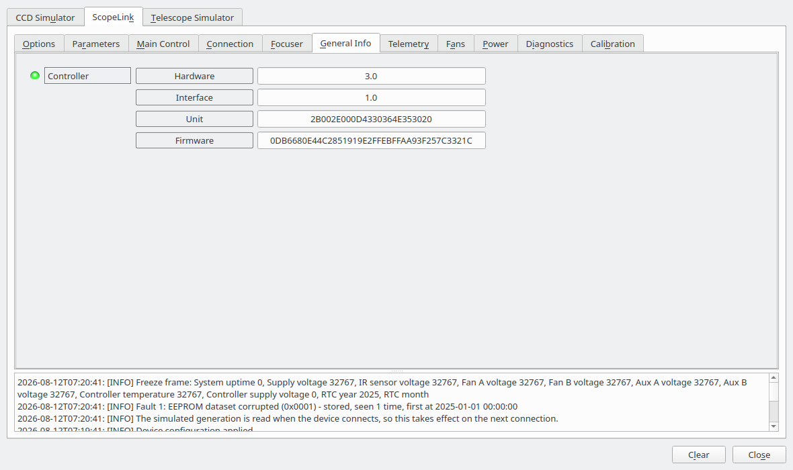

### Running without a controller

Turn **Simulation** on before connecting and the driver answers itself: no port is opened, and every tab
below behaves as it does on hardware, including motion, the flat panel, the fault store and the
configuration parameters. **Simulated hardware** on the Options tab picks which generation it imitates,
which is what makes the differences between them visible — the USB hub and the smart switch settings
appear and disappear as they would on the real controllers.

It is meant for trying the driver out, for reproducing a problem without the hardware to hand, and for
client development. The simulated controller is answerable and self consistent; it is not a model of the
firmware, and the values it reports are plausible rather than measured.

The same simulated controller is also available on a pseudo terminal, from the `scopelink-simulator`
command, for anything that needs a port rather than a driver.

## Focuser

Standard INDI focuser controls: absolute position, relative moves, abort, and sync.

The travel limit is read from the controller's own calibration when the driver connects, and
`FOCUS_MAX` is deliberately read-only — writing it from the focus module would silently overwrite a
bench calibration. Recalibrating is what the Calibration tab is for.

**Temperature** shows the ambient reading from the infrared sensor, and is what Ekos uses for
temperature-compensated focusing. If the sensor stops answering, the property goes to alert rather than
reporting the plausible-looking -273 °C the hardware sends in that case.

If a move ends with the motor stopped somewhere other than the commanded position, the driver reports an
alert rather than a completed move. That normally means the focuser is obstructed or the motor's stall
detection sensitivity is set too high.

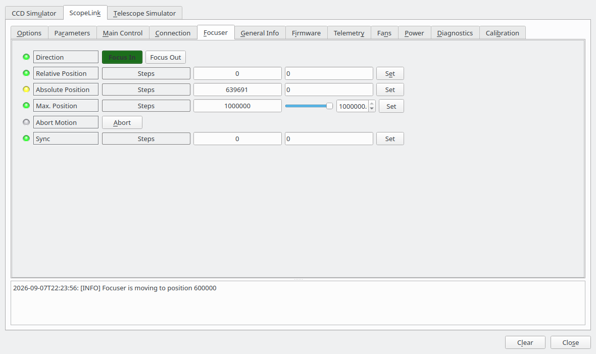

## Front flap (dust cap)

The flap is published as a dust cap, so Ekos opens and closes it as part of a sequence without being
asked each time.

**Park** closes the flap, **Unpark** opens it. The raw motor position and the fraction of travel are
shown alongside, which is useful while calibrating.

If the driver connects and finds the flap stopped somewhere between its end stops — after a power cut
mid-travel, for instance — it reports the state as unknown and **does not move it**. Close or open it
once to re-establish where it is.

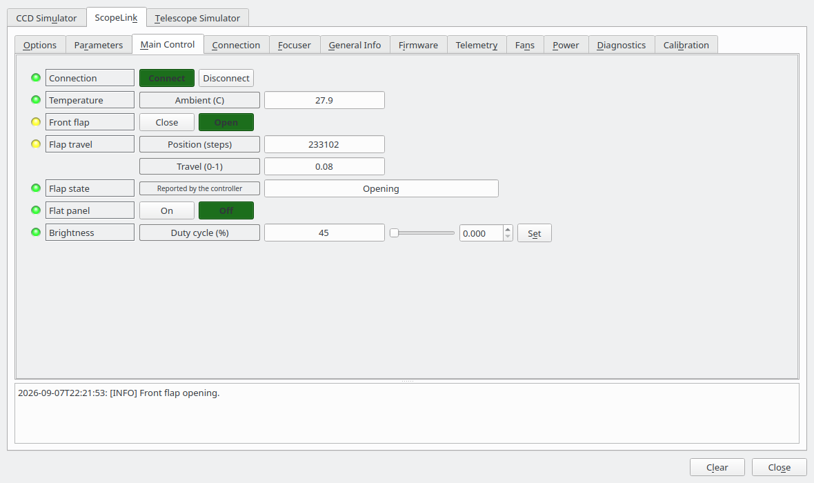

## Flat panel (light box)

**Flat panel** switches the panel on and off; **Brightness** sets the duty cycle from 0 to 100 %. Ekos
drives both automatically when taking flat frames: a flat job closes the cover, turns the panel on, takes
its frames and turns it off again, without being asked.

The brightness you set while the panel is off is remembered and applied when you switch it on. Switching
the panel on with the brightness at zero produces no light, and the driver says so in the log.

## Telemetry

Read-only. Supply, rear fan and side fan rail voltages; ambient and mirror temperature and the
difference between them; and the load on each motor.

With **Controller diagnostics** enabled in Options, a second group appears with the infrared sensor
supply, the controller's own supply and die temperature, CPU and peak CPU load, stack usage and the IÂ?C
error counter.

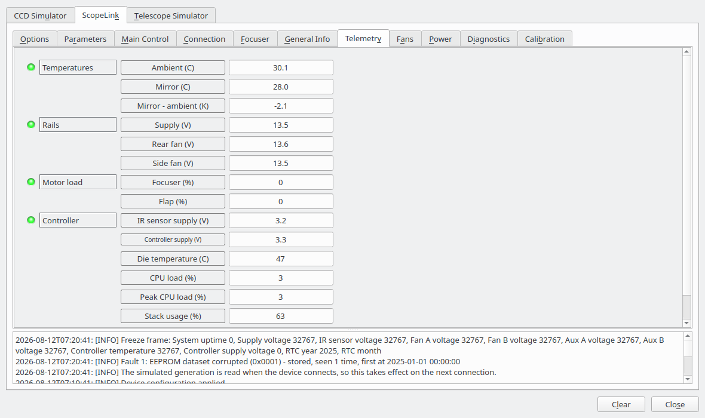

## Fans

Each fan can be left under the controller's own thermostat or taken over manually.

- **Manual control** — enables the override for each fan independently.
- **Commanded state** — what each fan does while its override is enabled.
- **Automatic targets** — the mirror-to-ambient temperature difference each fan aims at when it is not
  overridden, in Kelvin. Only offered on a unit with the temperature sensor fitted, since there is
  nothing to regulate against without it.

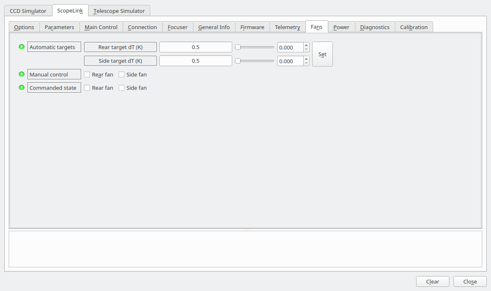

## Power

**Auxiliary outputs** switches the two auxiliary power outputs.

**USB hub** reports the downstream ports (generation 3): whether each is powered, and whether it has
tripped. A port fault lights red and is also recorded in the fault store.

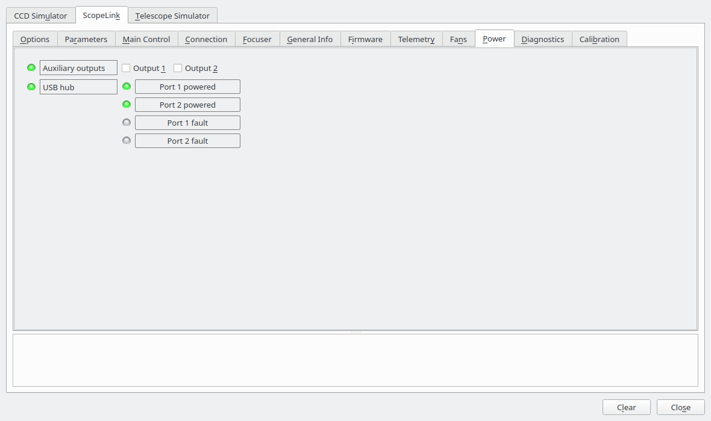

## Parameters

Every configuration value the connected controller holds, grouped by subsystem: focuser motor, flap
motor, fans, temperature, smart switch monitoring. Values are read when the driver connects.

Only the values you actually change are written. This matters: they live in EEPROM, which has a finite
number of write cycles, and the wear counters on the Diagnostics tab exist because of it. After a write
the driver reads the value back, so anything the controller clamped or refused is visible immediately.

- **Reload from controller** — read every value again.
- **Export to file** — write the whole configuration to the path in **Parameter file**. `~/` is
  expanded.
- **Import from file** — read that file and write any values that differ to the controller.

The file format is the one the vendor's Windows parameter editor reads and writes, so configurations
move between the two platforms. A file exported from a generation 3 unit can be imported on a
generation 2 one; values that generation does not hold are skipped.

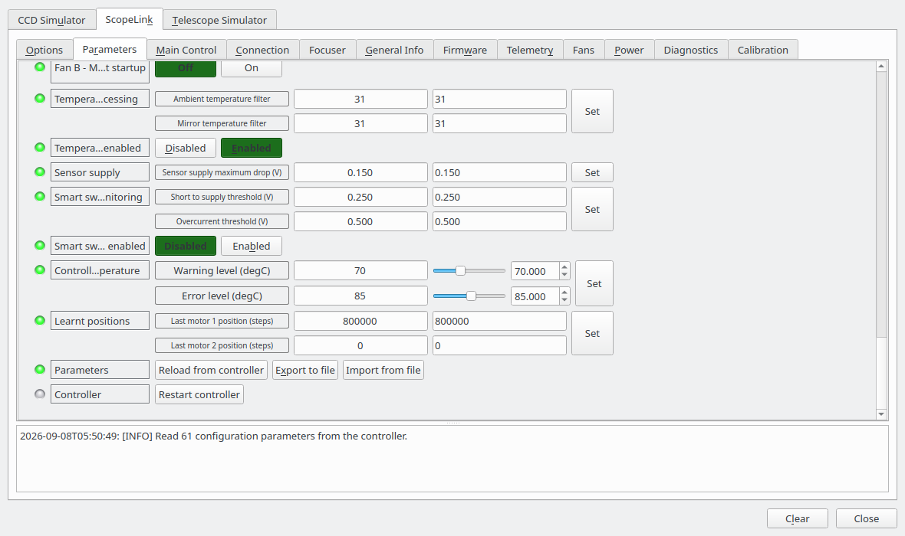

**Take an export before changing anything.** It is the only backup of a unit's calibration.

## Diagnostics

**Faults** shows how many diagnostic trouble codes are stored and how many are active right now.

- **Read fault store** — lists the stored codes with, for each, whether it is currently active, how many
  times it has been seen and when it was first recorded. The full freeze frame — around thirty values
  captured at the moment the fault was raised — is written to the driver log, where it can be copied
  into a support request.
- **Clear fault store** — clears every stored code and reads the store back. A code whose cause is still
  present reappears immediately, which is the point of reading it back.
- **Read EEPROM counters** — the wear counters for the controller's configuration memory.

**Link health** shows the transaction, retry and failure counts for the serial link, and how old the
most recent status sample is. Retries are normal on a busy USB bus; a rising failure count is not.

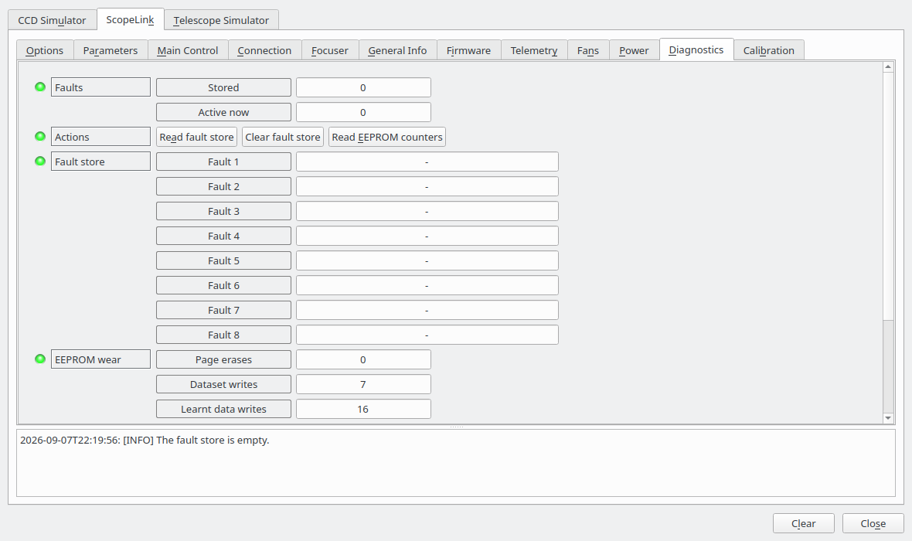

## Calibration

Establishes a motor's travel, for the focuser or the front flap. The procedure is the same for both:

1. Select the motor.
2. If the travel is unknown or wrong, press **Reset calibration**. The motor is then free to move
   anywhere, and believes it is in the middle of an unbounded travel.
3. Jog the motor to one end stop, using **Jog towards zero** and **Jog away from zero** with a jog size
   that gets smaller as you approach. Watch the motor load while you do — a rising load means you have
   reached the stop.
4. Press **Mark as zero**.
5. Jog to the other end stop.
6. Press **Mark as end of travel**.

**Stop** halts the selected motor immediately.

The travel readouts update as you go, and the driver picks up the new limit without a reconnect.

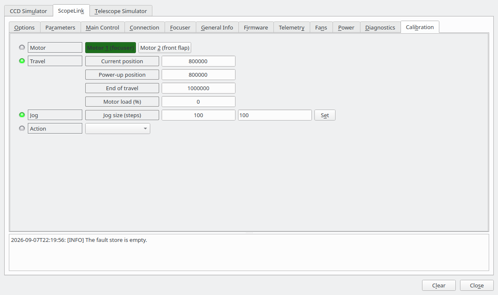

> **Take care with the front flap.** Once it is calibrated, Ekos will drive it automatically. A flap
> whose travel is set wrong will be driven into its end stop on every sequence.

## Troubleshooting

**The port cannot be opened.** Reload the udev rules with
`sudo udevadm control --reload-rules && sudo udevadm trigger` and unplug and replug the controller.
Failing that, add your user to the `dialout` group and log out and back in.

**The port keeps changing number.** `/dev/ttyACMn` is handed out in the order devices are plugged in.
Point the profile at the `/dev/serial/by-id/` name instead, as described under Connecting; it stays with
the unit.

**"No ScopeLink answered on …".** Something is on the port but it is not answering as a ScopeLink. Check
you have the right port — `scopelink-cli --port /dev/ttyACM0 info` is a quicker way to test than a full
client — and that nothing else has the port open. The driver refuses the connection rather than
half-connecting to an unknown device.

**"hardware generation N is not supported".** The controller is newer than the driver. Update the
driver.

**The driver disconnects itself during a session.** Three failed status polls in a row are treated as a
lost controller, after the protocol layer has already retried each one three times. Check the USB cable
and the supply voltage on the Telemetry tab; a supply sagging under load is the usual cause. The Link
health readout on the Diagnostics tab shows whether the link was struggling beforehand.

**No temperature readings.** Either the unit has no infrared sensor fitted — in which case the
properties are not offered at all — or the sensor has stopped answering, in which case they go to alert
and a fault is stored. Read the fault store to tell the two apart.

**The flap state is reported as unknown.** It stopped between its end stops, most likely because power
was lost mid-travel. Close or open it once to re-establish where it is.

## Reporting problems

Include:

- the four values from the **General Info** tab
- the driver log with **Debug** enabled, covering the problem
- the freeze frames from **Read fault store**
- an export of the parameters
