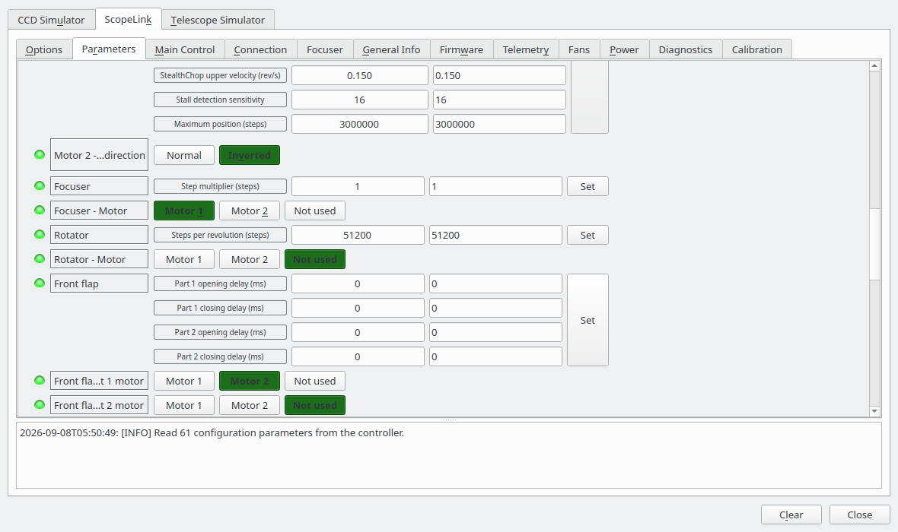
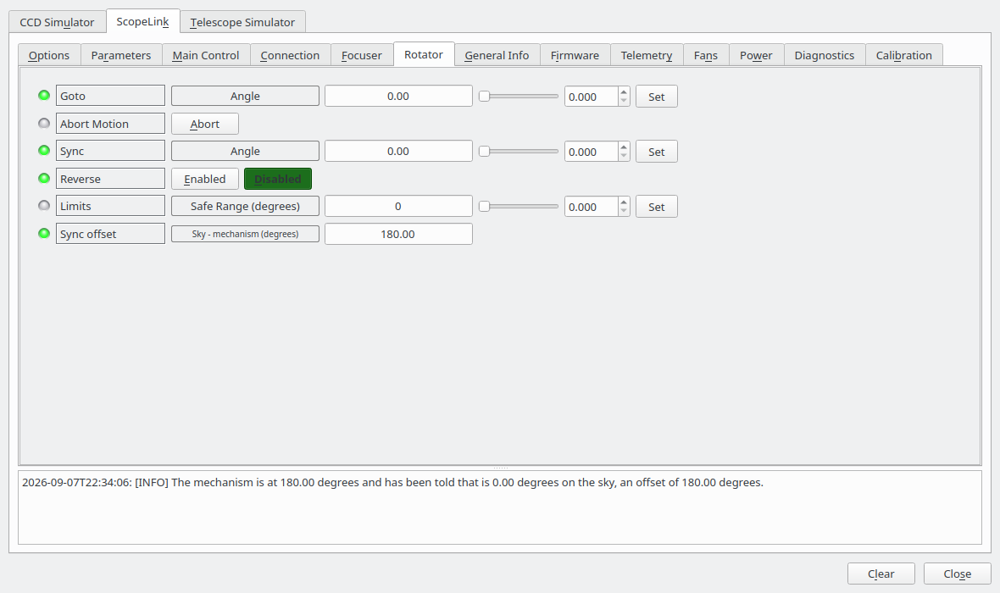
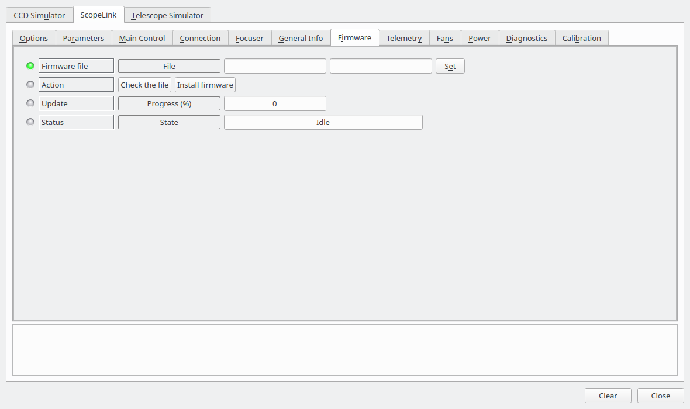

# ScopeLink

## Installation

| | |
|---|---|
| **Driver name** | ScopeLink |
| **Executable** | `indi_scopelink` |
| **Author** | Bence Toth, Astrolabs Hungary Kft. |
| **Maintainer** | Bence Toth &lt;bence.toth@astrolabs.hu&gt; |
| **Version** | 1.1 |
| **Device type** | Focuser, rotator, dust cap, light box, auxiliary |
| **Connection** | Serial (USB CDC-ACM) |
| **Minimum INDI** | 2.0.0 |
| **Platforms** | Linux (amd64, arm64) |

Install with `sudo apt install indi-scopelink`, or build it from source — the driver lives in
[indi-3rdparty](https://github.com/indilib/indi-3rdparty), and its `INSTALL.md` has the instructions.

After installing, reload the udev rules so the controller is reachable without root privileges:

```sh
sudo udevadm control --reload-rules && sudo udevadm trigger
```

## Overview

ScopeLink is a single-box telescope controller from Astrolabs. One USB connection drives:

- a stepper focuser
- a field rotator
- a motorised front flap over the telescope aperture, in up to three separately driven parts
- a flat panel
- two mirror cooling fans, thermostatically controlled against the mirror-to-ambient temperature
  difference or switched by hand
- two auxiliary power outputs
- a powered USB hub — two ports with per-port fault reporting on generation 3, six ports on generation 4

The driver publishes all of it as one INDI device. The interfaces it claims depend on what the connected
controller actually has, which is read out of the hardware at connect time.

It also reads and writes the controller's configuration, its fault store and its motor calibration, and
can replace its firmware — all over the same USB connection, with nothing else installed.

### Supported models

| Generation | Motors | Front flap | Aux power | USB hub | Smart switch diagnostics |
|---|---|---|---|---|---|
| 2 | 2 | yes | yes | no | no |
| 3 | 2 | yes | yes | 2 ports | yes |
| 4 | 3 | yes | yes | 6 ports | yes |

A rotator needs two things: firmware that knows what a rotator is, which means interface 1.1, and a
motor of its own to be assigned to. In practice that is a three motor controller, or a two motor one with
no front flap fitted.

**Generation 3 is the production hardware.** Generation 2 is the earlier controller; it runs the same
code path, differing only in what the capability read at connect time turns on. The driver is tested
against real units of both.

**Generation 4 is supported but has not been tested against hardware**, because none exists yet. It is
checked against the simulator, which serves the same frames from the same capability set the driver
decodes with.

### Which motor drives what

Up to interface 1.0 the motors were wired to their jobs: motor 1 focused and motor 2, where there was one,
opened the flap. From interface 1.1 — which is generation 4, and generation 3 units reflashed with that
firmware — the controller holds the mapping as a setting instead, and the driver reads it when it
connects. Everything follows from it:

- **The devices offered.** A controller with no motor assigned to the rotator publishes no rotator, and
  the same goes for the focuser and the front flap. The assignment is named in the log on every connect.
- **Which travel belongs to which device.** The focuser's calibrated end of travel is motor 1's on one
  controller and motor 3's on another; the driver reads the one the assignment points at.
- **How the flap is driven.** The controller is asked to open the flap rather than to move a motor, so a
  flap split into two or three parts is opened in the configured order with the configured delays between
  the parts — sequencing that runs in the controller, where nothing can be unplugged half way through it.
  A **Flap state** property shows what the controller reports about the flap as a whole, which is not the
  same question as where one of its motors is standing: a part waiting out its delay is still opening.

The assignment is on the **Parameters** tab, under Focuser, Rotator and Front flap. The settings offered
are the motors your controller actually has, and the rules are the controller's own — nothing may name a
motor that is not fitted, the flap parts have to be a run without a gap in it, and no motor may be claimed
by two functions. An assignment that breaks one of them is refused by the controller; if a controller is
somehow holding one anyway, the driver says what is wrong with it and offers no focuser, rotator or flap
until it is corrected.



**A change needs the controller restarted, not just reconnected.** The controller reads its
configuration when it starts and drives from that copy, so an assignment written while it is running is
stored but not acted on: it goes on driving the one it started with, and refuses a command for anything
the new assignment adds. The driver says as much in the log when you change one.

**Restart controller**, at the bottom of the Parameters tab, is what does it. The controller restarts, the
link drops while it leaves the USB bus and comes back — a few seconds — and the driver then connects
again by itself, which is when it decides which devices to offer. Pulling the power does the same thing;
so does a firmware update, which ends with a restart for exactly this reason. If the controller does not
come back within thirty seconds the driver says so and stops waiting; unplug it and plug it back in, then
connect again.

The infrared temperature sensor is a fitting option rather than a generation difference. On a unit
without one, the temperature readings, the mirror ΔT and the automatic fan targets are not offered at
all, rather than being offered and failing.

## Connecting

Select **ScopeLink** in the Focuser slot of your Ekos equipment profile. Ekos picks up the dust cap and
light box interfaces from the same device automatically once it connects, so the front flap appears in
the cap controls and the flat panel in the flat frame settings — there is no need to add the device
twice.

On the **Connection** tab, set the port. Anything but `/dev/ttyACMn`, which is renumbered whenever
another CDC device is plugged in first. With one controller, use the name the udev rule gives it:

```sh
ls -l /dev/scopelink
# /dev/scopelink -> ttyACM0
```

With more than one, use the per-unit name under `/dev/serial/by-id/`, since both claim `/dev/scopelink`
and one of them wins:

```sh
ls -l /dev/serial/by-id/
# usb-Astrolabs_ScopeLink_206135713630-if00 -> ../../ttyACM0
```

The number in that name is the controller's USB serial, so it identifies one physical unit and a saved
profile keeps working across reboots and however many other USB devices are plugged in. Without the udev
rule installed you also have to be in the `dialout` group to open the port.

> [!NOTE]
> **A controller flashed before the identifiers were assigned has neither of those names.** ScopeLink
> reported ST's generic USB identifiers, `0483:5740`, until Astrolabs was assigned `0483:a5d3` and
> `0483:a5d4` of its own, and every
> STM32 device running the stock USB CDC stack reports the generic pair too. The udev rule grants such a
> unit access and deliberately gives it no `/dev/scopelink`, because it could not tell it from any other
> such device. Its by-id name is
> `usb-STMicroelectronics_STM32_Virtual_ComPort_in_FS_Mode_<serial>-if00`, and everything else about the
> driver is the same.

The baud rate is offered because libindi's serial plugin expects one, but the controller is a CDC-ACM
device and ignores it.


Two options are worth setting before the first connection, on the **Options** tab:

- **Step multiplier** — how many controller steps make one client step. Leave it at 1 unless the
  focuser's travel is large enough that a client is unhappy with the numbers. It is applied when the
  driver connects, so changing it while connected has no effect until you reconnect. On a controller
  from interface 1.1 the multiplier is held in the controller instead and this setting is ignored; see
  the Focuser tab below.
- **Controller diagnostics** — off by default. Turning it on adds the controller's own die temperature,
  supply rail, CPU and stack load and I²C error counter to the Telemetry tab. These are for
  fault-finding, not for observing.
- **Simulated hardware** — which controller the driver imitates while **Simulation** is on. Ignored
  otherwise. Four entries for three generations, because a generation is not a frame layout: the same
  generation 3 board runs interface 1.0 and 1.1, and 1.1 is a different layout rather than a different
  board. Generation 4 exists only on 1.1 and so needs no second entry. See "Running without a controller"
  below.


On a successful connection the **General Info** tab shows the hardware and interface versions, the
unit's hardware identifier and the firmware string. Quote all four in any support request.


### Running without a controller

Turn **Simulation** on before connecting and the driver answers itself: no port is opened, and every tab
below behaves as it does on hardware, including motion, the flat panel, the fault store and the
configuration parameters. **Simulated hardware** on the Options tab picks which controller it imitates,
which is what makes the differences between them visible — the USB hub and the smart switch settings
appear and disappear as they would on the real controllers, and the interface 1.1 entry sends the frame
layout that firmware uses.

It is meant for trying the driver out, for reproducing a problem without the hardware to hand, and for
client development. The simulated controller is answerable and self consistent; it is not a model of the
firmware, and the values it reports are plausible rather than measured.

The same simulated controller is also available on a pseudo terminal, from the `scopelink-simulator`
command, for anything that needs a port rather than a driver.

## Focuser

Standard INDI focuser controls: absolute position, relative moves, abort, and sync.

The travel limit is read from the controller's own calibration when the driver connects, and
`FOCUS_MAX` is deliberately read-only — writing it from the focus module would silently overwrite a
bench calibration. Recalibrating is what the Calibration tab is for.

**Step multiplier** is how many motor steps make one step as a client sees them. On a controller from
interface 1.1 onwards it is held in the controller rather than in the driver, so this driver and the
vendor's Windows one read the same number and a step means the same thing on either — set it on the
Parameters tab, under Focuser. On earlier controllers it is the driver setting on the Options tab, applied
when the driver connects.

**Temperature** shows the ambient reading from the infrared sensor, and is what Ekos uses for
temperature-compensated focusing. If the sensor stops answering, the property goes to alert rather than
reporting the plausible-looking -273 °C the hardware sends in that case.

If a move ends with the motor stopped somewhere other than the commanded position, the driver reports an
alert rather than a completed move. That normally means the focuser is obstructed or the motor's stall
detection sensitivity is set too high.


## Rotator

Offered on a controller that has a motor assigned to the rotator, and only once that motor has a
calibrated travel — every angle is turned into a step count against it, so an uncalibrated rotator is not
published at all. Calibrate it on the Calibration tab and reconnect.

**Goto** rotates to a position angle in degrees. How far the mechanism can actually turn is whatever it
was calibrated to: less than a full turn on a rotator limited by its cabling, and more than one on a
rotator that is not. An angle the travel does not reach is refused rather than approximated to the nearest
end stop, which would leave a client believing it had rotated the camera when it had not. Where the travel
reaches an angle more than once, the driver drives to the reachable step count nearest to where the
mechanism already is — the shortest move, and the one that does not unwind a cable it has just wound up.

**Sync** tells the driver that the mechanism is where it is and the sky is somewhere else than it thought.
Nothing is sent to the controller and nothing moves: what changes is the offset between the mechanism and
the sky, shown as **Sync offset** and saved with the configuration, so a sky calibration outlasts the
connection.

**Reverse** runs the angle the other way against the mechanism. It does not re-measure the sync offset,
which was taken with the angle running the other way — sync again after reversing.

**Abort motion** stops the rotator where it is. The position it stops at is a real position like any
other, so nothing needs re-establishing afterwards, unlike a flap stopped mid-travel.

**Safe range** is the standard INDI rotator limit, and this driver does not use it: what a rotator can
reach is decided by its calibrated travel, which is measured rather than typed in. Leave it at 0.



## Front flap (dust cap)

The flap is published as a dust cap, so Ekos opens and closes it as part of a sequence without being
asked each time.

**Park** closes the flap, **Unpark** opens it. The raw motor position and the fraction of travel are
shown alongside, which is useful while calibrating; on a flap of several parts they are the first part's,
and **Flap state** is what describes the flap as a whole.

If the driver connects and finds the flap stopped somewhere between its end stops — after a power cut
mid-travel, for instance — it reports the state as unknown and **does not move it**. Close or open it
once to re-establish where it is.

A flap made of more than one part needs every part calibrated before it is offered as a dust cap: a flap
with one calibrated half cannot be opened any more than one with none can.


## Flat panel (light box)

**Flat panel** switches the panel on and off; **Brightness** sets the duty cycle from 0 to 100 %. Ekos
drives both automatically when taking flat frames: a flat job closes the cover, turns the panel on, takes
its frames and turns it off again, without being asked.

The brightness you set while the panel is off is remembered and applied when you switch it on. Switching
the panel on with the brightness at zero produces no light, and the driver says so in the log.

## Telemetry

Read-only. Supply, rear fan and side fan rail voltages; ambient and mirror temperature and the
difference between them; and the load on each motor.

With **Controller diagnostics** enabled in Options, a second group appears with the infrared sensor
supply, the controller's own supply and die temperature, CPU and peak CPU load, stack usage and the I²C
error counter.


## Fans

Each fan can be left under the controller's own thermostat or taken over manually.

- **Manual control** — enables the override for each fan independently.
- **Commanded state** — what each fan does while its override is enabled.
- **Automatic targets** — the mirror-to-ambient temperature difference each fan aims at when it is not
  overridden, in Kelvin. Only offered on a unit with the temperature sensor fitted, since there is
  nothing to regulate against without it.


## Power

**Auxiliary outputs** switches the two auxiliary power outputs.

**USB hub** reports the downstream ports: whether each is powered, and — on generation 3 — whether it has
tripped. A port fault lights red and is also recorded in the fault store. A generation 4 hub has six ports
and no separate fault lamps: it reports a tripped port by dropping that port's power, which the lamp
beside it already says.


## Parameters

Every configuration value the connected controller holds, grouped the way the firmware groups them:
one group per motor, then the focuser, the rotator and the front flap, each of the two fans, temperature
processing, the sensor supply, smart switch monitoring, the controller's own temperature, and the
positions the unit has learnt. Values are read when the driver connects. Which groups appear depends on
the unit — a value a controller does not hold is not offered, so a two motor controller has no **Motor
3**, and the **Focuser**, **Rotator** and **Front flap** groups appear only on a controller that holds the
motor assignment.

The distinction between **Motor 1** and **Focuser** is the one interface 1.1 introduced. A motor group is
the motor itself — its currents, its acceleration, whether its direction is inverted — and belongs to the
motor whatever it is driving. The Focuser, Rotator and Front flap groups are the job: which motor does it,
and the few settings that belong to the job rather than to the hardware, such as the flap's opening order
and the delays between its parts. See ["Which motor drives what"](#which-motor-drives-what).

Values are shown in the units the firmware uses them in, so a velocity reads as `1.500 rev/s` rather than
as the number the controller stores, and the limits on each field are the ones the controller will
actually accept. A value it would refuse is refused here, with a message saying what the range is, rather
than being sent and bounced.

A setting that is one of a fixed set of choices — a motor's direction, a fan's startup override,
whether temperature processing is on, which motor drives what — is its own switch rather than a number, so
it can be set by name:

```
indi_setprop 'ScopeLink.PARAM_MOTOR1_INVERT_DIRECTION.MOTOR_DIR_INVERTED=On'
```

Only the values you actually change are written. This matters: they live in EEPROM, which has a finite
number of write cycles, and the wear counters on the Diagnostics tab exist because of it. After a write
the driver reads the value back, so anything the controller clamped or refused is visible immediately.

- **Reload from controller** — read every value again.
- **Export to file** — write the whole configuration to the path in **Parameter file**. `~/` is
  expanded.
- **Import from file** — read that file and write any values that differ to the controller.

The file format is the one the vendor's Windows parameter editor reads and writes, so configurations
move between the two platforms. A file exported from a generation 3 unit can be imported on a
generation 2 one; values that generation does not hold are skipped.


**Take an export before changing anything.** It is the only backup of a unit's calibration.

## Diagnostics

**Faults** shows how many diagnostic trouble codes are stored and how many are active right now.

- **Read fault store** — lists the stored codes with, for each, whether it is currently active, how many
  times it has been seen and when it was first recorded. The full freeze frame — around thirty values
  captured at the moment the fault was raised — is written to the driver log, where it can be copied
  into a support request.
- **Clear fault store** — clears every stored code and reads the store back. A code whose cause is still
  present reappears immediately, which is the point of reading it back.
- **Read EEPROM counters** — the wear counters for the controller's configuration memory.

**Link health** shows the transaction, retry and failure counts for the serial link, and how old the
most recent status sample is. Retries are normal on a busy USB bus; a rising failure count is not.


## Calibration

Establishes a motor's travel. Every motor the controller has is listed, labelled with what it currently
drives — including one that drives nothing, because a motor has to be calibrated before it is worth
assigning to anything. The procedure is the same for all of them:

1. Select the motor.
2. If the travel is unknown or wrong, press **Reset calibration**. The motor is then free to move
   anywhere, and believes it is in the middle of an unbounded travel.
3. Jog the motor to one end stop, using **Jog towards zero** and **Jog away from zero** with a jog size
   that gets smaller as you approach. Watch the motor load while you do — a rising load means you have
   reached the stop.
4. Press **Mark as zero**.
5. Jog to the other end stop.
6. Press **Mark as end of travel**.

**Stop** halts the selected motor immediately.

The travel readouts update as you go, and the driver picks up the new limit without a reconnect.


> **Take care with the front flap.** Once it is calibrated, Ekos will drive it automatically. A flap
> whose travel is set wrong will be driven into its end stop on every sequence.

Calibration always addresses a motor rather than a job, on every controller: finding where a flap stands
open means driving its motor before anything knows what its open position is. A controller from interface
1.1 refuses a motor command for a motor it is currently driving as part of a flap sequence, so stop the
flap before calibrating one of its parts.

## Firmware

Replaces the controller's firmware with a file Astrolabs supplies.

Firmware is issued as **one encrypted file per unit**, named after that unit's identifier — the **Unit**
value on the General Info tab. A file named for anything else is refused before the controller is
touched, because a file for one unit cannot be decrypted by another.

1. Put the path of the file in **Firmware file**.
2. Press **Check the file**.
3. Press **Install firmware**, and leave the controller plugged in until it finishes.

The progress bar and the status line follow the update; the driver log records each step. The whole thing
takes well under a minute.



Nothing else has to be installed. The controller carries a boot loader of its own that appears as the
same serial port the firmware does, so the update is an ordinary conversation on the port the driver is
already connected to. There is no DFU mode to enter, no second device on the bus and nothing to run as
root — and the driver never decrypts the file. It hands it over unopened, and the boot loader is what
checks the contents as they arrive and then verifies what it programmed by reading the flash back.

**Your configuration is expected to survive.** Only the firmware area is erased, and the controller keeps
its parameters elsewhere. The driver still saves the whole configuration to `~/.indi/` before it starts,
and afterwards puts back anything the new firmware does not already have right — and tells you if it had
to. The file it saved is in the same format as **Export to file** on the Parameters tab, so it can be
restored by hand.

The update will not start while a motor is moving, and the device cannot be disconnected while one is
running.

> **If an update is interrupted** — the power goes, or the driver is stopped — the controller is left in
> its boot loader with no firmware to run. It is not bricked. Connect to it again: the driver will say
> that is what it found, and will offer the Firmware tab and nothing else. Install the firmware again
> from there, or run `scopelink-cli --port … flash <file>`. The boot loader is in a part of the flash an
> update cannot write to, so it is always still there to try again through.

Firmware updates are not simulated: the one question worth asking of one is whether a real controller
survives it.

## Troubleshooting

**The port cannot be opened.** Reload the udev rules with
`sudo udevadm control --reload-rules && sudo udevadm trigger` and unplug and replug the controller.
Failing that, add your user to the `dialout` group and log out and back in.

**The port keeps changing number.** `/dev/ttyACMn` is handed out in the order devices are plugged in.
Point the profile at `/dev/scopelink`, or at the `/dev/serial/by-id/` name where there is more than one
controller, as described under Connecting; both stay with the unit.

**"No ScopeLink answered on …".** Something is on the port but it is not answering as a ScopeLink. Check
you have the right port — `scopelink-cli --port /dev/ttyACM0 info` is a quicker way to test than a full
client — and that nothing else has the port open. The driver refuses the connection rather than
half-connecting to an unknown device.

**"hardware generation N is not supported".** The controller is newer than the driver. Update the
driver.

**The driver disconnects itself during a session.** Three failed status polls in a row are treated as a
lost controller, after the protocol layer has already retried each one three times. Check the USB cable
and the supply voltage on the Telemetry tab; a supply sagging under load is the usual cause. The Link
health readout on the Diagnostics tab shows whether the link was struggling beforehand.

**No temperature readings.** Either the unit has no infrared sensor fitted — in which case the
properties are not offered at all — or the sensor has stopped answering, in which case they go to alert
and a fault is stored. Read the fault store to tell the two apart.

**The flap state is reported as unknown.** It stopped between its end stops, most likely because power
was lost mid-travel. Close or open it once to re-establish where it is.

**There is no focuser, no rotator or no dust cap where you expected one.** On a controller that holds the
motor assignment, a device is offered only when a motor is assigned to it *and* that motor has a
calibrated travel. Look at the log line the driver prints on connect, which names the whole assignment;
then set the assignment on the Parameters tab or calibrate the motor on the Calibration tab. A new
assignment needs the controller restarted, which is what **Restart controller** on the Parameters tab
does; a new calibration needs only a reconnection. Nothing about this changes while connected,
deliberately — a client that has been handed a focuser cannot have a different one put underneath it.

**"The controller's motor assignment is unusable".** The controller is holding an assignment that breaks
one of its own rules — a motor that is not fitted, a gap in the flap parts, or one motor claimed by two
functions — and the message says which. No focuser, rotator or front flap is offered until it is
corrected on the Parameters tab. A controller normally refuses such an assignment when it is written, so
seeing this at all usually means the configuration came from a unit with more motors than this one.

**A device you have just assigned a motor to refuses everything**, with "no motor is assigned to it"
even though the Parameters tab plainly says one is. The controller has not restarted since you changed
it, so the assignment it is driving from is still the old one. Press **Restart controller** on the
Parameters tab.

**A move comes back refused.** The controller checks a move against its own idea of the mechanism, and
the driver reports what it said rather than a generic failure: no motor assigned, no calibration to move
within, a position outside the travel, or the mechanism already moving and not taking a new target until
it stops. The last of those is worth knowing during a flap sequence — a flap part waiting out its
opening delay is still moving as far as the controller is concerned.

**"This ScopeLink is sitting in its boot loader and has no firmware to run".** A firmware update did not
finish. Nothing is broken and nothing has been lost: install the firmware again from the Firmware tab,
which is the only tab offered in that state. See Firmware, above.

**"… is not named after this ScopeLink".** Firmware files are encrypted for one unit and named after it.
Either the file belongs to another controller, or it has been renamed — some browsers add a suffix to a
downloaded file. Restore the name it was delivered with; the identifier it must match is the **Unit**
value on the General Info tab.

**"The transfer lost its place N bytes in".** A USB frame was dropped mid-update. The controller decrypts
the file as it arrives and cannot be picked up again part way through, so the update has to start from
the beginning — press **Install firmware** again. The controller is waiting in its boot loader and no
firmware has been started, so nothing else needs doing.

## Reporting problems

Include:

- the four values from the **General Info** tab
- the driver log with **Debug** enabled, covering the problem
- the freeze frames from **Read fault store**
- an export of the parameters
