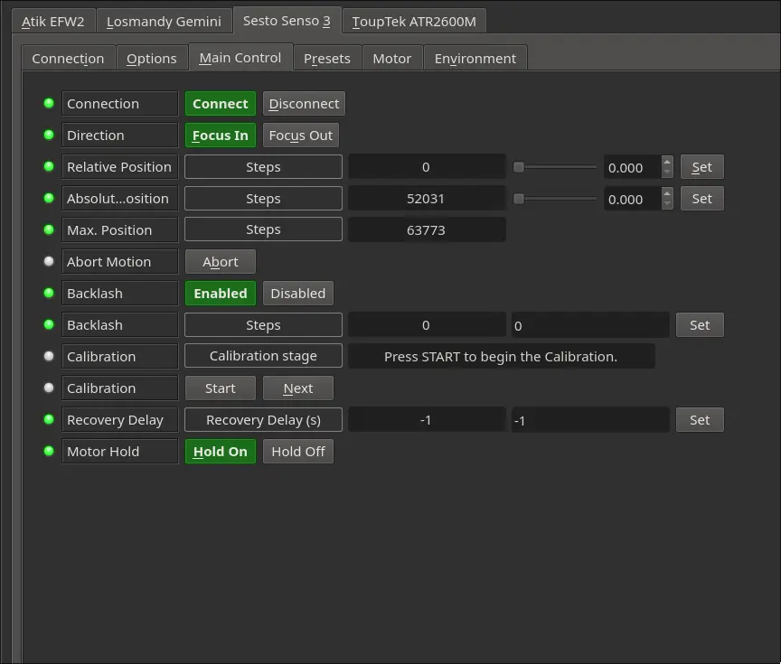

## Features

SESTO SENSO 3 is an advanced robotic focusing motor for rack-and-pinion or Crayford-style focusers, combining high precision, flexibility, and ease of use in a compact design. Developed and manufactured in Italy by PrimaLuceLab, it introduces key innovations such as the integrated position encoder, which allows manual movement of the focuser without losing motor position with Automatic Position Recovery option, and the new Self Centering Clamp 2 (SCC2) for fast installation to many focusers without external brackets or adapters.

With USB-C and built-in WiFi connectivity, you can control SESTO SENSO 3 from your computer or wirelessly via the Virtual HandPad using a smartphone or tablet. Its high-precision motor delivers 0.7 micron per step resolution, making it ideal for both visual observation and astrophotography. 

The SESTO SENSO 3 comes in 3 variants:

* **SESTO SENSO 3:** The default variant used to attach to most focusers
* **SESTO SENSO 3 SC:** A variant for mounting onto focusers of SCT (Schmidt-Cassagrein) type telescopes
* **SESTO SENSO 3 LS:** A variant for mounting onto telephoto lenses

### Main Control Tab

-   **Direction**: Select focus direction.
-   **Relative Position**: Move the focus by a relative amount in the direction specified above.
-   **Absolute Position**: Move focuser to an absolute position in ticks.
-   **Max Position**: The recorded max position by the Calibration tool
-   **Abort Motion**: Aborts any ongoing motion of the SESTO SENSO 3
-   **Backlash**: Settings to control Backlash applied directly by the SESTO SENSO 3
-   **Calibration**: Used to calibrate the min and max positions of the SESTO SENSO 3 with your focuser 

### Connection

-   Select connection port, by default, it's set to /dev/ttyUSB0.
-   Select Auto-search parameters.

### Presets

You may set pre-defined presets for common focuser positions in the _Presets_ tab.

-   **Preset Positions**: You may set up to 3 preset positions. When you make a change, the new values will be saved in the driver's configuration file and are loaded automatically in subsequent uses.
-   **Preset GOTO**: Click any preset to go to that position

## Operation

Set the focuser connection port under the  _Connections_  tab. Click connect in the  _Main Control_  Tab to establish connection. The INDI SestoSenso driver provides basic functionality that includes settings of absolute and relative position. Use  _Sync_  to set the current position to any desired value. It can be used by autofocus software such as Ekos.
