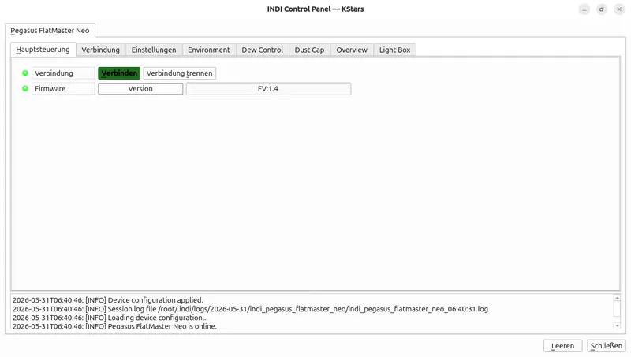
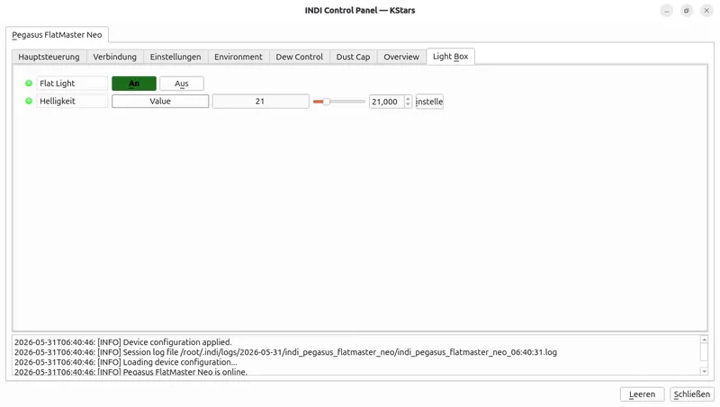
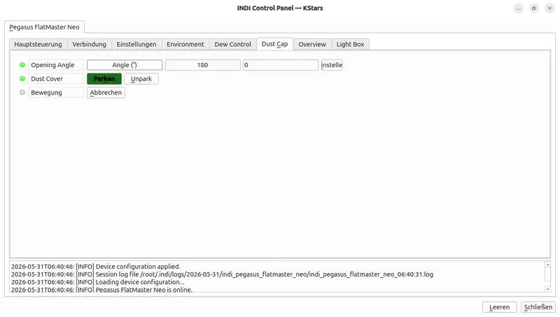
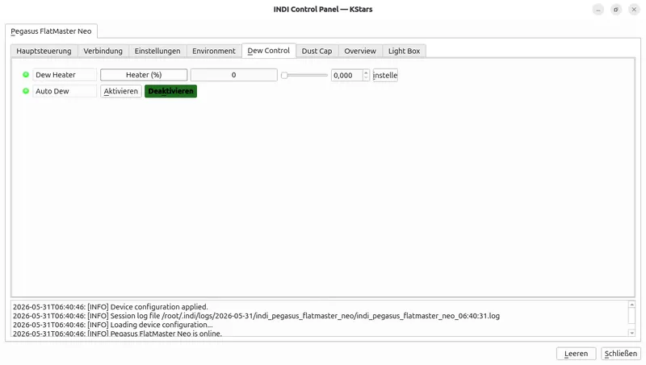
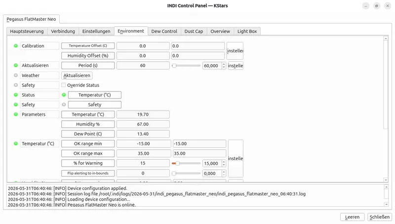
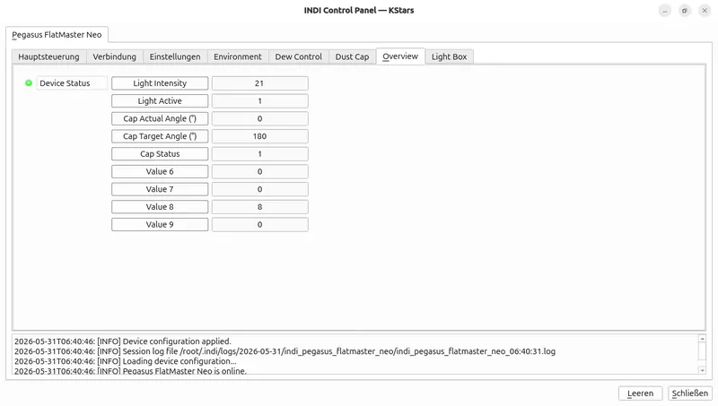

# Pegasus FlatMaster Neo — INDI Auxiliary Driver

The Pegasus FlatMaster Neo driver provides INDI support for the Pegasus Astro FlatMaster Neo flat field panel and environmental sensors.

## Overview

This driver implements the following INDI interfaces:

- `AUX_INTERFACE`
- `LIGHTBOX_INTERFACE`
- `DUSTCAP_INTERFACE`
- `WEATHER_INTERFACE`

The driver communicates with the FlatMaster Neo over a USB serial link. It exposes lightbox control, dust cap control, dew heater control, weather sensors, and device status reporting.

## Supported Hardware

- Pegasus Astro FlatMaster Neo

## Driver Metadata

- Driver Name: `Pegasus FlatMaster Neo`
- Executable: `indi_pegasus_flatmaster_neo`
- Family: Lightbox, Dustcap
- Manufacturer: Pegasus Astro
- Platforms: Linux, BSD, macOS
- Version: 1.0

## Installing & Running

The driver is built as part of the INDI core package.

To run the driver manually:

```bash
indiserver -v indi_pegasus_flatmaster_neo
```

If you build only this driver from the INDI source tree, the build target is also `indi_pegasus_flatmaster_neo`.

## Connectivity

### USB Serial

The FlatMaster Neo uses a USB serial interface. The driver uses the connection plugin to scan serial ports and match devices whose system name contains `FlatMaster`.

- Default baud rate: `9600`
- Connection type supported: USB serial only
- Network / Bluetooth: not supported by this driver

### First Time Connection

1. Power on the FlatMaster Neo.
2. Start the driver in an INDI client or manually with `indiserver -v indi_pegasus_flatmaster_neo`.
3. In the client connection panel, select the detected serial port or allow automatic scanning.
4. Click Connect.

On successful connection, the driver performs a handshake using `F#` and expects the response to contain `FMNEO`.

## Features

- Lightbox power on/off
- Adjustable lightbox brightness (0–100)
- Dust cap open/close and angle control (0–270°)
- Dew heater control (0–100%)
- Auto dew mode on/off
- Calibration offsets for temperature and humidity
- Real-time sensor values for temperature, humidity, and dew point
- Device status overview via FlatMaster Neo status query

## Driver Controls

### Firmware

The driver exposes a `Firmware` text property showing the reported firmware version.




### Light Box

The `Light Box` tab exposes:

- `On/Off`
- `Brightness`

The driver sends commands `FE:0` / `FE:1` for enable/disable and `FL:<value>` for brightness.



### Dust Cap

The `Dust Cap` tab exposes:

- `Open`
- `Close`
- `Angle`

The driver sends `FS:0` to park the cap and `FS:1` to unpark/open it.



### Dew Control

The `Dew Control` tab exposes:

- `Dew Heater` percentage
- `Auto Dew` enable/disable

The driver sends `DH:<value>` for heater power and `PD:0` / `PD:1` for auto dew.



### Environment / Weather

The `Environment` tab exposes:

- `Temperature`
- `Humidity`
- `Dew Point`
- `Calibration Offsets` for temperature and humidity

The driver reads weather data from the device using `ES` and reads/saves offsets with `CR`, `CT:<value>`, and `CH:<value>`.



### Device Status

The driver publishes an overview status property showing:

- Light intensity
- Light active state
- Cap target angle
- Cap actual angle
- Cap status
- Auxiliary status values from the FlatMaster Neo response



## Operation

- Connect the device via USB.
- Use the `Light Box` controls to turn the panel on/off and adjust brightness.
- Use the `Dust Cap` controls to set the cap angle or park/unpark the cover.
- Use the `Dew Control` panel to change heater power and toggle automatic dew control.
- Monitor temperature, humidity, and dew point in the `Environment` tab.
- Adjust the provided temperature and humidity offsets if the readings differ from a reference sensor.

## Troubleshooting

- If the driver fails to connect, verify the FlatMaster Neo is powered and visible as a serial device.
- Ensure no other application is using the same serial port.
- Check that the driver handshake returns `FMNEO`; if not, the device may not be a supported FlatMaster Neo.
- If properties do not update, reconnect and verify the device responds to `FA`, `ES`, and `CR` queries.

## Notes

- The driver is intended for use with INDI clients such as INDI Control Panel, KStars/Ekos, and other INDI-compatible tools.