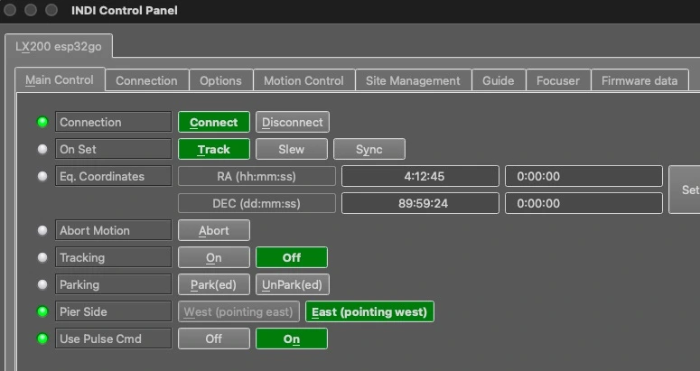
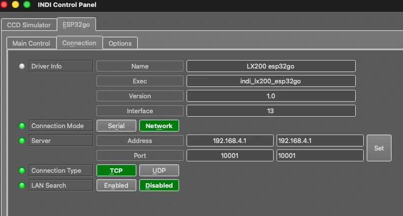
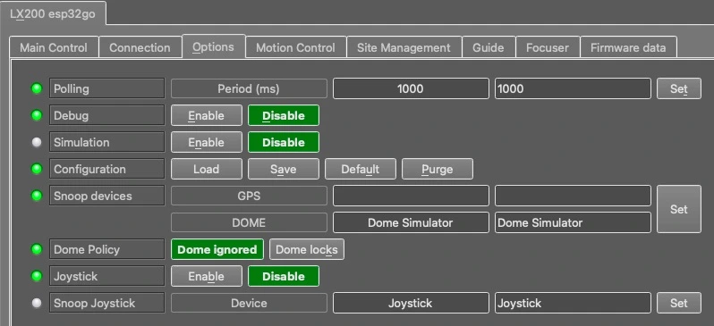
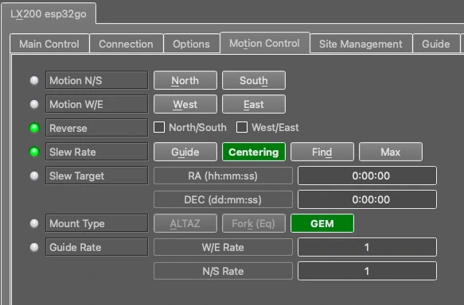
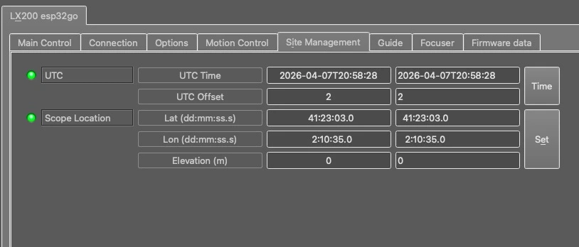
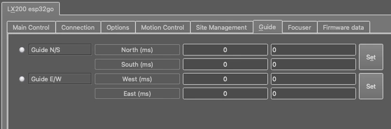
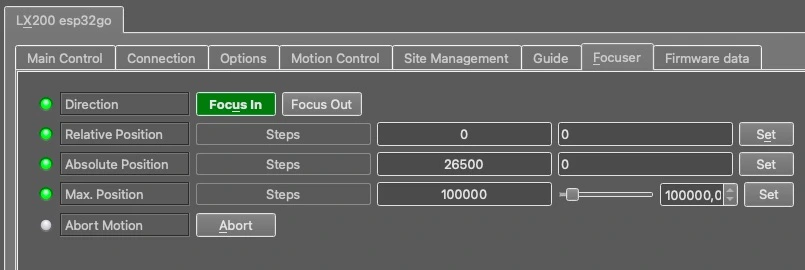
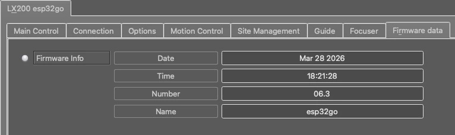

# ESP32go Driver

This is the documentation for the ESP32go and PicGoto DIY mount controller driver. You can find documentation of the project at [PicGoto/ESP32go Official Group](https://groups.io/g/PicgotoGroup).

## Features
This INDI driver is not limited to ESP32 based versions (ESP32go) as it supports PIC based boards (PicGoto).

Current features are:
* All basic LX200 standard features.
* Park goes to the selected Home position and parks there.
* Pulse guiding.
* Guide rate as selected in the mount.
* Internal focuser with absolute positioning (stepper motor version only).

## Connectivity
### 1. Serial
The controller connects via USB or Bluetooth serial.
### 2. Network
It supports networked connections over TCP/IP, through Wifi.
The IP address is determined by the network (or 192.168.4.1 in case of stand-alone operation). The port number is 10001.
### 3. First Time Connection

When running the driver for the first time, go to the Connection tab and select the port to connect to. You can also try connecting directly and the driver shall automatically scan the system for candidate ports. You can select Network and enter the IP address and port for ESP32go. After making changes in the Connections tab, go to Options tab and save the settings.

## Operation

### Main Control
The main control tab is where the primary control of ESP32go takes place. To track an object, enter the equatorial of date (JNow) coordinates and press Set. The mount shall then slew to an object and once it arrives at the target location, it should engage tracking at the selected tracking rate which default to Sidereal tracking. Slew mode is different from track mode in that it does not engage tracking when slew is complete. To sync, the mount must be already tracking. First change mode to Sync, then enter the desired coordinates then press Set. Users will seldom use this interface directly since many clients (e.g. KStars) can slew and sync the mount directly from the sky map without having to enter any coordinates manually.

Park button will first slew the mount to the home position defined in the mount and after that it will park the mount.

Tracking can be engaged and disengaged by toggling the Tracking property.

### Options

Under the options tab, you can configure many parameters before and after you connect to the mount.

* Configuration: Load or Save the driver settings to a file. Click default to restore default settings that were shipped with the driver.

* Simulation: Enable to disable simulation mode for testing purposes.

* Debug: Enable debug logging where verbose messaged can be logged either directly in the client or a file. If Debug is enabled, advanced properties are created to select how to direct debug output.

### Motion control
Under motion control, manual motion controls along with speed and guide controls are configured.

* Motion N/S/W/E: Directional manual motion control. Press the button to start the movement and release the button to stop.
* Slew Rate: Rate of manual motion control above where 1x equals one sidereal rate.
* Guide Rate: Guiding Rate for RA & DE. This setting is taken from the mount and can not be edited here. 0.5 means the mount shall move at 50% of the sidereal rate when the pulse is active. The sideral rate is ~15.04 arcseconds per second. So at 0.3x, the mount shall move 0.3*15.04 = 4.5 arcsecond per second. When receiving a pulse for 1000ms, the total theoretical motion 4.5 arcseconds.

### Site management
Time and Location settings are configured in the Site Management tab.

* UTC: UTC time and offsets must be set for proper operation of the driver upon connection. The UTC offset is in hours. East is positive and west is negative.
* Location: Latitude and Longitude must be set for proper operation of the driver upon connection. The longitude range is 0 to 360 degrees increasing eastward from Greenwich.

### Guide
* Guide N/S/W/E: Guiding pulses durations in milliseconds. This property is meant for guider application (e.g. PHD2) and not intended to be used directly.

### Focuser
Focuser tab shows the settings to control the stepper motor that moves the focuser.
Set a relative position to move that amount of steps in the selected direction.
Set an absolute position to move the focuser to that concrete position.

### Firmware data
Firmware data tab displays information on the detected mount type and firmware version. If using a PicGoto mount, this tab will show no values.

