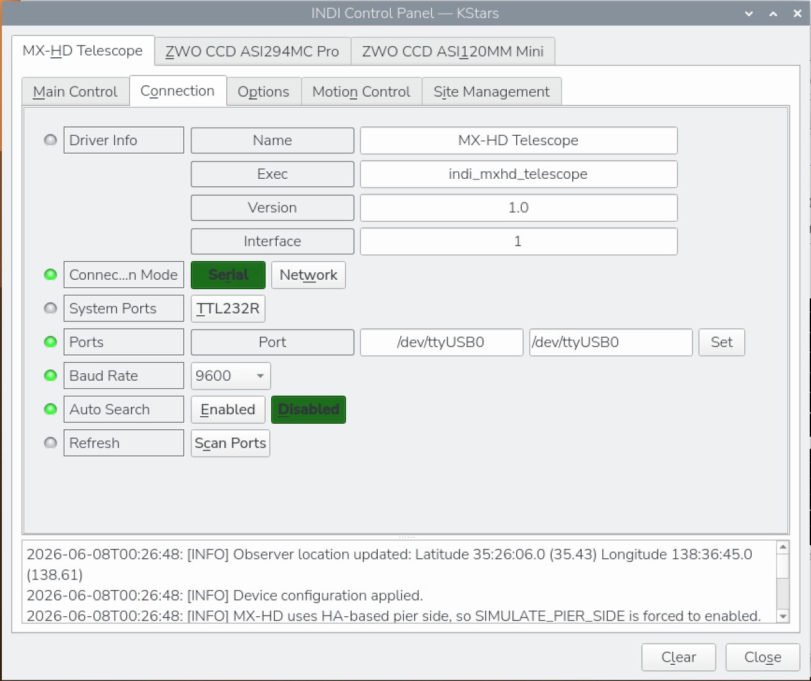
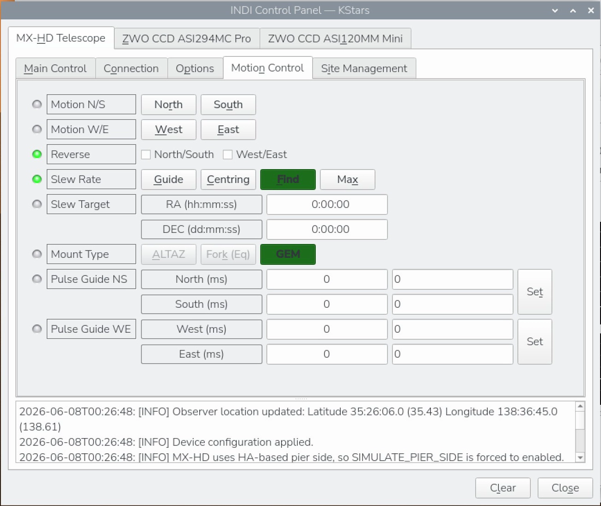
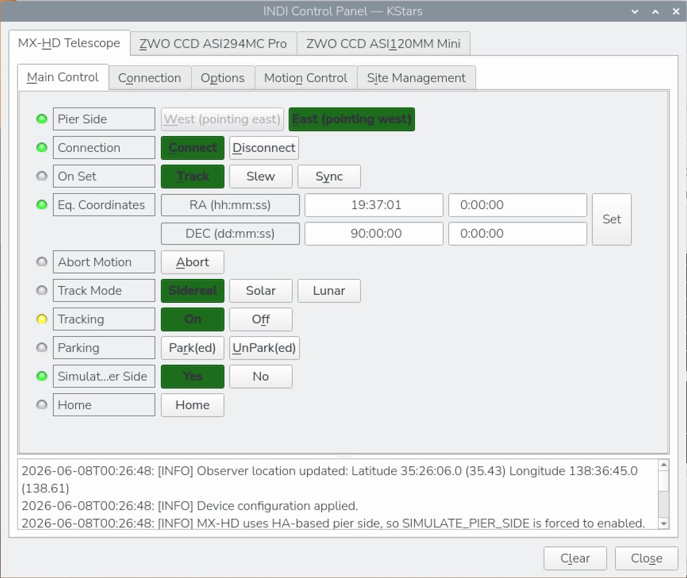

---
title: MX-HD Telescope
categories: ["mounts"]
description: INDI driver for the MX-HD equatorial mount.
thumbnail: ./mx-hd.webp
---

## Features

The MX-HD driver provides the following functionality:

- USB serial connection
- Bluetooth RFCOMM serial connection when exposed by the operating system as a serial device
- Goto / Slew
- Sync
- Abort
- Park
- Unpark
- Driver-specific HOME action (`MXHD_HOME`)
- Standard INDI slew-rate selection
- Standard `TELESCOPE_TRACK_MODE`
  - Sidereal
  - Solar
  - Lunar
- Timed pulse guiding
- INDI site / time synchronization
- HA-based `TELESCOPE_PIER_SIDE` reporting for GEM operation

## Connectivity

The driver expects the mount to be presented by the operating system as a normal serial device.

Typical device names are:

- `/dev/ttyUSB0`
- `/dev/rfcomm0`

The driver has been tested with:

- USB serial at `9600` baud
- Bluetooth RFCOMM serial presented by the OS as a serial device

In KStars/Ekos:

1. Select `MX-HD Telescope` as the mount driver.
2. Open the INDI Control Panel.
3. In the Connection tab, set the serial port to the correct device.
4. Set the baud rate to match the mount connection.
5. Connect the mount.

## Main Control

The main control area provides access to:

- current RA/Dec readout
- Goto
- Sync
- Abort
- Park / Unpark
- `MXHD_HOME`

Important behavior:

- `MXHD_HOME` returns the mount to its fixed HOME pose
- `Unpark` intentionally performs a HOME-return sequence before the driver clears the parked state

This behavior is specific to MX-HD and is used to restore a known mount attitude / position solution before remote operation resumes.

## Tracking

The driver uses standard INDI `TELESCOPE_TRACK_MODE` and supports:

- Sidereal
- Solar
- Lunar

These are translated to the corresponding MX-HD commands internally.

## Slew Rates

The driver supports the standard INDI slew-rate property with four rates:

- Guide
- Centering
- Find
- Max

These are mapped to the corresponding MX-HD rate commands and can be used by compatible INDI clients.

## Site, Time, and Time Zone

The driver accepts `TIME_UTC` and `GEOGRAPHIC_COORD` from the INDI client and forwards them to the mount.

Important details:

- INDI longitude is interpreted as east-positive
- MX-HD receives longitude converted to its west-positive format
- INDI UTC offset is east-positive
- MX-HD receives the reversed-sign value required by its `:SG` command
- Local date and time sent with `:SC` and `:SL` are derived from UTC plus the INDI-provided offset

The driver intentionally uses INDI-provided values and does not read the mount's stored site values back into the control flow.

## HOME and Unpark

The driver does not currently use standard `TELESCOPE_HOME`. Instead, HOME is exposed as a driver-specific `MXHD_HOME` action.

This was chosen because standard `TELESCOPE_HOME` handling caused client compatibility issues during testing.

`MXHD_HOME` returns the mount to its fixed HOME pose.

`Unpark` intentionally performs a HOME-return sequence before clearing the parked state. This is required by MX-HD to restore a known mount attitude / position solution before normal remote operation resumes.

## Pier Side

MX-HD does not report pier side directly.

The driver derives `TELESCOPE_PIER_SIDE` from hour angle using:

- the current UTC at each status update
- the current RA
- the INDI-provided east-positive longitude

`SIMULATE_PIER_SIDE` is enabled because pier side is inferred rather than reported directly by the mount.

## Pulse Guiding

Timed pulse guiding is implemented and works with guider clients such as PHD2.

Supported guide directions:

- North
- South
- East
- West

## Options

The driver follows the standard INDI `POLLING_PERIOD` property.

- Default polling period: `4000 ms`

Status polling uses the MX-HD `@ST#` command.

## Notes

- Bluetooth is supported only when the operating system exposes the connection as a standard serial RFCOMM device.
- During slews and HOME recovery, the driver avoids querying RA/Dec until the mount returns to a stable state in order to avoid transient serial timeouts.

## Tested Configuration

- Real MX-HD hardware
- Raspberry Pi 5
- libindi 2.2.1
- KStars/Ekos
- USB serial (`/dev/ttyUSB0`)
- Bluetooth RFCOMM serial (`/dev/rfcomm0`)
