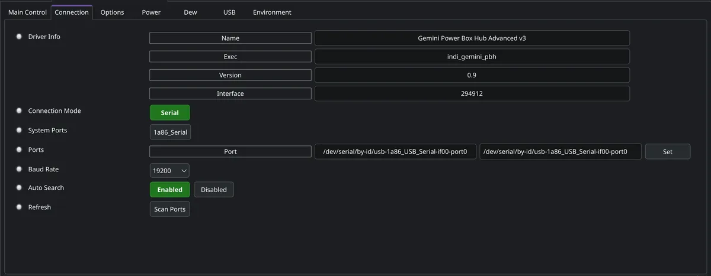
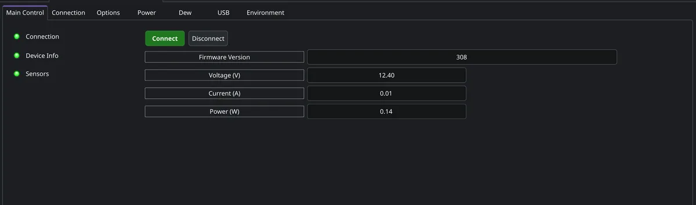
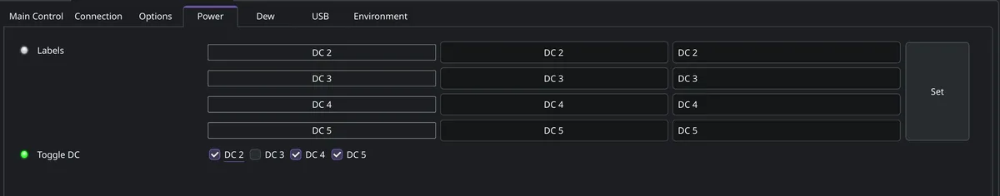
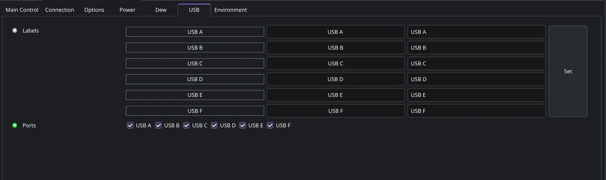
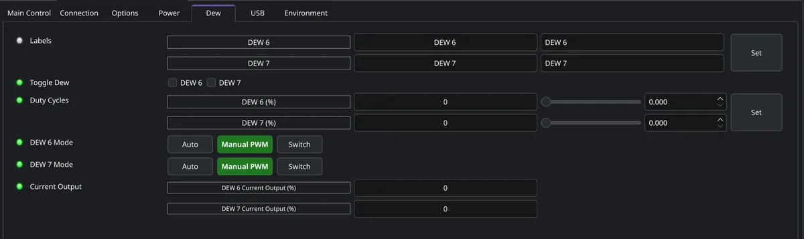
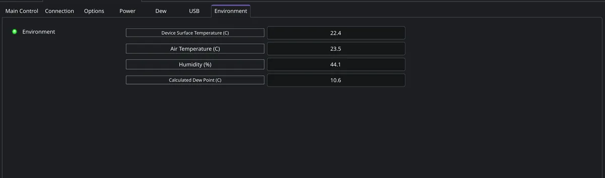

## Features

The INDI driver for the Gemini Power Box Hub Advanced v3 provides:

-   Automatic USB serial device discovery and device identification
-   Four independently switchable 12V DC outputs
-   Six independently switchable USB outputs
-   Two independently configurable dew heater channels with Automatic, Manual, and On/Off modes
-   Environmental monitoring (controller temperature, ambient temperature, humidity, and dew point)
-   Power monitoring (input voltage, current, and power consumption)
-   Firmware version detection and compatibility checking

> [!IMPORTANT]
> Firmware below 308 is rejected by the driver. Firmware 308 is accepted with a warning. Firmware
> 309 or newer is recommended - update the controller before using it with the INDI driver.

## Connect

Connect the Gemini Power Box Hub Advanced v3 to the PC/StellarMate using a USB cable, then apply
external DC power to the device. Select **Gemini Power Box Hub Advanced v3** from the **Power**
device category and press **Connect**.

The driver automatically discovers the serial port and verifies that the connected device is a
supported Gemini controller before establishing a connection.

The Connection tab exposes the following if manual configuration is ever needed:

-   **Connection Mode** — the Gemini Power Box Hub Advanced v3 communicates over USB serial
-   **System Ports** — serial ports currently detected on the system
-   **Port** — manual port selection when automatic discovery is disabled
-   **Baud Rate** — fixed at **19200 baud**; leave at the default
-   **Auto Search** — when enabled (recommended), scans available ports and connects to a
    compatible controller automatically

For most installations, leave Auto Search enabled. Manual port selection is primarily intended for
systems with multiple serial devices or for troubleshooting.

## Operation

### Main Control

Once connected, the Main Control tab displays the firmware version, input voltage, current draw,
power consumption, and connection status. Telemetry refreshes automatically.

### Power

The Power tab controls the four 12V DC outputs independently. Toggle each port on or off; changes
are transmitted immediately to the controller and reflected in the interface once the device
confirms them.

### USB

The USB tab controls the six USB outputs independently, in the same way as the DC outputs - useful
for power-cycling USB devices or managing overall power consumption.

### Dew

Two independent dew heater channels can each be set to:

-   **Automatic** mode, driven by the environmental sensors
-   **Manual** PWM output
-   **On/Off** (switch) mode

> [!NOTE]
> Automatic mode requires both the AHT20 environmental sensor and the DS18B20 temperature probe to
> be connected and detected by the controller. If either is missing, Automatic mode is unavailable
> and only Manual or On/Off modes can be used.

### Environment

Continuously displays device (lens) surface temperature, ambient air temperature, relative
humidity, and calculated dew point, updated automatically as new telemetry arrives.

## Usage & Tips

-   Update the controller firmware to version 309 or newer when available.
-   Use Automatic dew heater mode whenever both environmental sensors are installed.
-   Assign descriptive names to power and dew heater outputs in your INDI client to simplify
    equipment management.
-   Verify the reported supply voltage matches your expected power source before an imaging
    session.
-   Disconnect from the device before removing USB or DC power.

## Troubleshooting

**Driver cannot connect**
-   Verify the device is powered and the USB cable is connected.
-   Ensure no other application is using the serial port.

**Automatic dew heater mode is unavailable**
-   Verify that both the AHT20 environmental sensor and DS18B20 temperature probe are connected and
    detected by the controller.

**Environmental readings are unavailable**
-   Verify the required sensors are installed and functioning correctly.
-   Update to firmware version 309 or newer.

## Issues

There are no known bugs for this driver. If you found a bug, please report it at INDI's GitHub
[Issues](https://github.com/indilib/indi/issues) page, including the driver version, firmware
version, and an INDI debug log.
