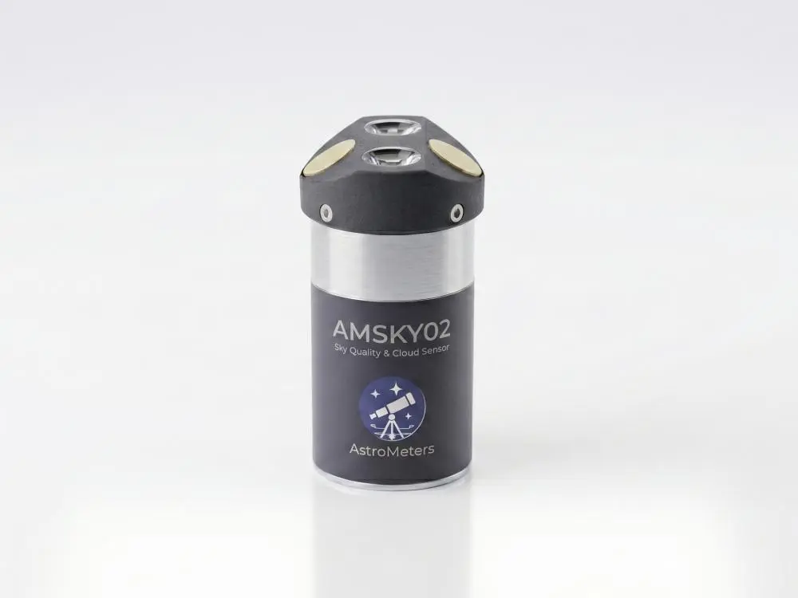
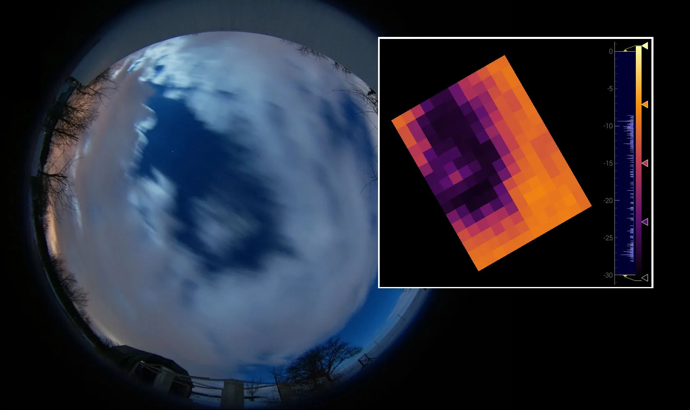

## Overview

The **[AMSKY02](https://astrometers.eu/products/AMSKY02/)** is a professional, weatherproof sky sensor designed for autonomous and remotely operated observatories. It is the successor to the [AMSKY01](/weather-stations/astrometers/amsky01/amsky01) and features a dual-sensor architecture combining two independent SQM channels with a high-resolution pixel-array infrared cloud detector.



> **Compatibility:** AMSKY02 uses the same `indi_amsky01` driver and communication protocol as [AMSKY01](/weather-stations/astrometers/amsky01/amsky01). Both models are fully interchangeable at the software level.

## Features

- **Dual sky brightness (SQM)** – two independent TSL2591 sensors with 10° narrow-field and 60° wide-field of view, both outputting lux and mag/arcsec².
- **Dual IR cloud sensor (32×24 px)** – two MLX9064x thermopile arrays providing a combined 150°×110° field of view; 64×48 pixel high-resolution variant available.
- **Water-pooling resistant design** – sensor head geometry prevents water accumulation on optical surfaces.
- **Temperature & humidity** – SHT41 precision sensor for ambient conditions and dew point.
- **USB-C and RS-485 interfaces** – USB-C for plug-and-play, RS-485 for industrial-grade long-distance communication.
- **IP53W weatherproof enclosure** – rated for continuous 24/7 outdoor operation.

## Cloud Detection

The dual thermopile array acts as a low-resolution thermal camera for the sky. Unlike single-point sensors, the pixel sensor allows spatial analysis of cloud coverage:



*Comparison of an optical all-sky image with the AMSKY thermopile sensor output. Clouds are clearly visible as warmer regions in the IR thermal map.*

**Benefits of a pixel sensor:**

- **Spatial cloud detection** – see not only if clouds are present, but exactly where and how many.
- **Accurate sky background** – averaging only the coldest pixels minimises the influence of warm obstacles at the edge of the field of view.
- **Robust automation** – algorithms can ignore local obstructions (trees, buildings) and focus on clear-sky regions.
- **Real-time visualisation** – instantly visualise cloud structure and movement.

## INDI Driver

The driver `indi_amsky01` supports both [AMSKY01](/weather-stations/astrometers/amsky01/amsky01) and AMSKY02.

### Starting the driver

```bash
indiserver indi_amsky01
```

### Connection

In KStars/Ekos, select the **AstroMeters AMSKY01** driver (works for both generations). Connect via:

- **Serial** – direct USB-C connection (`/dev/ttyACM0` or stable by-id symlink).
- **TCP** – if the device is shared over the network via `ser2net`.

#### Stable device naming (udev)

```udev
SUBSYSTEM=="tty", ATTRS{idVendor}=="1209", ATTRS{idProduct}=="ae02", SYMLINK+="ttyAMSKY"
```

Apply with:
```bash
sudo udevadm control --reload-rules && sudo udevadm trigger
```


## Python Viewer

A GUI visualiser (`amsky01_viewer.py`) is available for real-time display of the dual IR thermal map, both SQM channels and environmental data.

```bash
python3 amsky01_viewer.py --port /dev/ttyACM0 --baud 115200
```


## Technical Specifications

| Parameter | [AMSKY01](/weather-stations/astrometers/amsky01/amsky01) | [AMSKY02](https://astrometers.eu/products/AMSKY02/) |
|---|---|---|
| Cloud detection | MLX90641 16×12 px, 75°×110° FoV | Dual MLX9064x 32×24 px, 150°×110° FoV *(64×48 variant available)* |
| Sky brightness (SQM) | Single sensor, 10° or 60° FoV | Dual sensor: 10° and 60° FoV |
| Temperature range | −15 °C to +50 °C | −30 °C to +70 °C |
| Humidity | SHT4x | SHT41 |
| Interfaces | USB-C (CDC serial), RS-485 | USB-C (CDC serial), RS-485 |
| Power supply | USB bus power or 8–13 V DC | USB bus power or 8–13 V DC |
| Ingress protection | IP53W | IP53W |

## Typical Applications

- Autonomous observatory control – dome closure based on real-time cloud detection.
- Sky quality monitoring networks – standardised mag/arcsec² measurements.
- Remote telescope operations – reliable weather monitoring for unattended sessions.
- RS-485 / SCADA integration – building automation and facility management.
- Research – detailed sky temperature mapping for atmospheric studies.

## Resources

- [AstroMeters documentation](https://astrometers.eu/docs/AMSKY/)
- [Product page](https://astrometers.eu/products/AMSKY02/)
- [AMSKY01 driver documentation](/weather-stations/astrometers/amsky01/amsky01)
